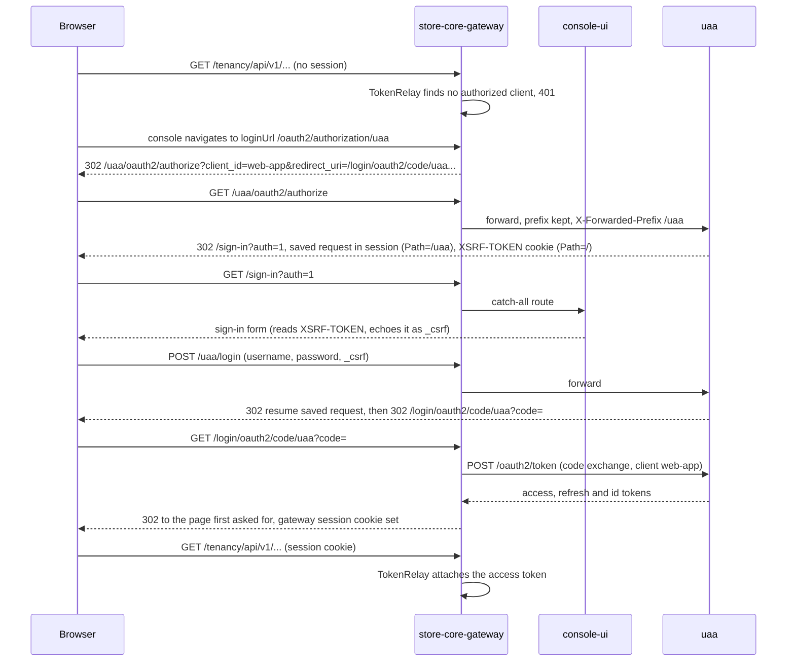
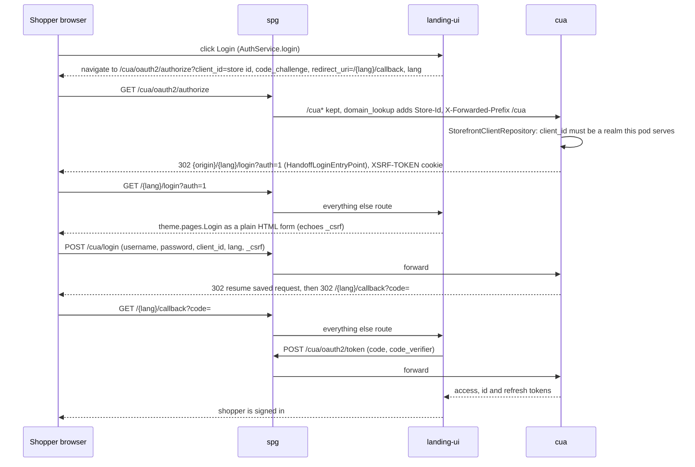
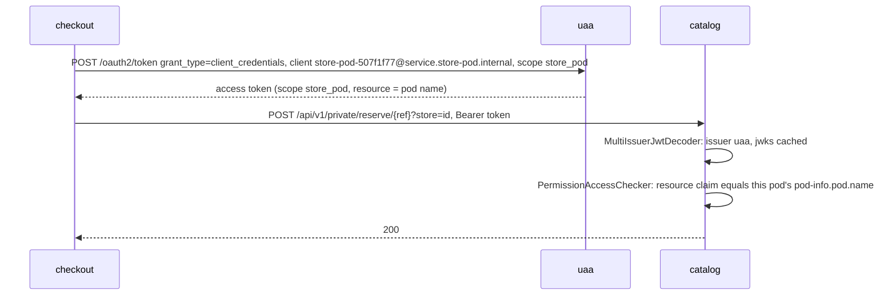

# Authentication

Two identity servers from one codebase: uaa for staff and merchants, cua for shoppers, and the service-to-service credentials (C4 level 3).

uaa (`store-core/uaa`, :8001) and cua (`store-pod/cua`, :8124) are both Spring Authorization Servers built on `store-commons/sso/sso-core`. They differ in whom they authenticate and where they are reached, not in how they are built. uaa is one instance for the whole platform and is reached through store-core-gateway at `/uaa`. cua is one per pod, headless, and is reached through spg at `/cua`. Every pod service is a resource server that trusts both. Legend: [system context](/architecture/system-context#legend).

| | uaa | cua |
|---|---|---|
| Who | platform staff, org owners, merchants, service accounts | shoppers |
| Reached at | `<console origin>/uaa/**` via the gateway | `<store host>/cua/**` via spg |
| Renders a login page | its own embedded SPA on its own host; the console's `/sign-in` when reached through the gateway | never; landing-ui renders the theme's Login page |
| Self-registration | no; provisioned or invited | `POST /cua/api/v1/public/registration` |
| Realm (user pool) | `platform`, exactly one | one per store |
| Deployment | shared | one per pod |

## Console sign-in



Everything visible happens on the console's origin. The gateway is the OAuth2 client, holds the session and relays the access token; console-ui holds no tokens (`loginUrl: '/oauth2/authorization/uaa'`, `apiUrl: ''`). uaa is reached through the gateway's `/uaa` route with the prefix intact, so uaa's `PathPrefixFilter` reports `/uaa` as its context path and its session cookie lands at `Path=/uaa`, separate from the console's session at `/`. The `XSRF-TOKEN` cookie is pinned to `/` (`AppSecurityConfig.csrfCookies()`) so a page uaa never rendered can read it. The redirect to `/sign-in?auth=1` comes from `HandoffLoginEntryPoint`; without the `auth=1` marker the console's `/sign-in` route just starts the flow again. Logout ends two sessions: the gateway's, and uaa's at `/uaa/connect/logout` on the same origin. Reached directly on its own host, uaa has no context path and serves its own embedded SPA, which is how a platform administrator administers uaa itself. Route mechanics: [gateway routing](/architecture/gateway-routing).

## Storefront sign-in



landing-ui is a PKCE public client whose `client_id` is the store's `StoreMerchantId`. `StorefrontClientRepository` builds the registered client from the realm and derives the allowed `redirect_uri` set from the request origin, because a store is reachable on its subdomain and any number of custom domains in any language. cua renders no HTML: `CuaSecurityConfig` replaces sso-core's default entry point with `HandoffLoginEntryPoint(StorefrontUrls.locator(...))`, which redirects to `{origin}/{lang}/login?auth=1` after validating `lang` as a language code. A failed login comes back as `login?auth=1&error=invalid|social|expired`, a token the storefront translates. `PromptLoginFilter` enforces `prompt=login`, so a live shopper session is dropped once before the form shows. Registration is `POST /cua/api/v1/public/registration` (`PublicRegistrationController` in sso-core, `?store=`), followed by the same login flow. Social login starts at `/cua/api/v1/public/social-logins?store=&lang=`.

cua pins its issuer to the pod endpoint (`pod-info.pod.endpoint`) and refuses to start without one. Unpinned, Spring Authorization Server derives the issuer from the request host, which for a shopper is an arbitrary custom domain that no trust list can enumerate.

## Service to service



Every service registers one `client_credentials` client named `s2s` against uaa in its own `application.yml`:

| Layer | Client id | Scope | What the resource server checks |
|---|---|---|---|
| store-core (gateway, tenancy, billing, pod-registry) | `store-core@service.store-core.internal` | `store_core` | nothing store-specific; the control plane reads any store by design |
| store-pod (merchant, catalog, checkout, payment, cua, ...) | `store-pod-<pod short id>@service.store-pod.internal` | `store_pod` | the token's `resource` against this pod's own `pod-info.pod.name`, so a token from one pod cannot call another |

The `s2s` registration is what authenticates the declarative `@HttpExchange` clients built by `RestClientBuilder`; callers name a service (`"catalog"`) and the interceptor attaches the token. Separate from it, the uaa admin SDK (`store-commons/uaa-client`, `AdminUserClient`, `OAuth2TokenManager`) authenticates with its own `admin-sdk` client, `client_credentials` with scope `super_admin`. That scope is platform-wide, so the caller (tenancy, for example) is responsible for tenant scoping through the user's `org` and `store` metadata. Secrets checked into `application.yml` are local seeds and are overridden per environment.

## Two meanings of "realm"

| Term | Class | Means | Values |
|---|---|---|---|
| Issuer realm | `IssuerRealm` (`store-commons/autoconfigure`, `s2s/jwt`) | which authorization server minted the token | `uaa`, `cua` |
| Realm | `RealmId` (`store-commons/sso/sso-commons`) | which user pool a principal belongs to inside one server; scopes `users`, `roles`, `settings`, `identity_providers`, `audit_events` | `platform` for uaa; one per store for cua |

Every realm lives inside exactly one issuer realm. uaa has one realm and no realm selector. cua has one realm per store, which is what makes the same email two different shoppers in two different stores. Reading `IssuerRegistry` or `MultiIssuerJwtDecoder`, the realm is the server; reading anything under `sso-core`, it is the user pool.

## Audiences and the two-realm issuer map

A pod service must accept a seller token (uaa), a shopper token (cua) and an internal service token (uaa) on the same endpoints. `store-commons/autoconfigure/src/main/resources/store-pod-lcl-config.yml` (and its `-fargate` twin) declares both issuers:

```yaml
spring.security.oauth2.resourceserver.jwt.issuers:
  uaa:
    uris: [ <uaa schema>://<uaa domain>, <uaa schema>://<uaa domain>:<port> ]
    jwk-set-uri: <uaa>/oauth2/jwks
  cua:
    uris: [ <spg schema>://<spg domain>/cua, <spg schema>://<spg domain>:<port>/cua ]
    jwk-set-uri: <spg>/cua/oauth2/jwks
    grants: [ ROLE_CUSTOMER, SCOPE_OPENID ]
```

- Issuers are keyed by realm and matched normalized (`UrlNormalize` drops `:80` and `:443`), because a realm answers on several equivalent URLs.
- `grants` is the realm's authority ceiling, applied by `RealmAwareJwtGrantedAuthoritiesConverter` after claim parsing. Both servers write roles into the same `roles` claim, so without the cap a shopper token claiming `ORG_ADMIN` would be granted it. cua tokens can confer nothing but `ROLE_CUSTOMER` and `SCOPE_OPENID`; the uaa realm declares no cap because its clients carry arbitrary scopes.
- Every principal also gains `REALM_<name>`, which `StoreRoleAccessChecker` uses to refuse a staff check for a shopper principal and the reverse.
- `jwk-set-uri` is preferred over OIDC discovery: discovery costs a blocking call on the first request and asserts a literal issuer match, too strict for a realm reachable at several URLs.
- An untrusted, unparseable or issuer-less token fails as `BadJwtException`, which becomes a 401.

The cua issuer is the spg-fronted URL with `/cua`, which is exactly why spg forwards `/cua*` with the prefix intact ([edge and custom domains](/architecture/edge-spg)).

## The authorization model

Authentication says who is asking; one evaluator says what they may touch, and it is reached only through `@PreAuthorize`:

```java
@PreAuthorize("hasPermission(#merchantStore,'StoreMerchantId','STORE-POD.CATALOG.*')")
```

`CustomPermissionEvaluator` (`store-commons/autoconfigure`, `s2s/config/internal`) ignores `targetType` and dispatches on the permission string into `PermissionAccessChecker`, which names the audience of each token and asks `StoreRoleAccessChecker` the one question a claim can answer. An unknown permission string falls to `default -> false`; the three-argument `hasPermission` overload always denies. There is no annotation and no aspect: `PermissionAccessChecker` is a plain class reached only from the evaluator.

| Principal | Issued by | Compared against |
|---|---|---|
| Super admin | uaa, `ROLE_SUPER_ADMIN` | nothing, but only billing and pod-registry widen to it; store reads stay 403 |
| Org admin | uaa, `ROLE_ORG_ADMIN` + `org` claim | the store's owner via `StoreOrgOwnerRetriever` |
| Store admin or moderator | uaa, role + `org` + `store` claims | the `store` claim against `?store=` |
| Shopper | cua, `ROLE_CUSTOMER` + `realm` claim | the `realm` claim against `?store=` |
| Pod service | uaa client credentials, `scope=store_pod`, `resource` | this pod's `pod-info.pod.name` |
| Store-core service | uaa client credentials, `scope=store_core` | nothing |

A service that cannot look up a store's owner refuses org admins, and a pod with no `pod-info` refuses every same-pod check. Both fail closed.

**`store-ownership: ENFORCED` or `DELEGATED`.** Tenancy and billing set `com.asrevo.cvhome.s2s.store-ownership: DELEGATED`: the shared gate admits any org admin and the service does the org check itself, so it can answer a foreign store with 404 rather than a 403 that confirms the store exists. Everywhere else the default `ENFORCED` applies and the gate checks.

**Which paths are open differs by layer.** Pod services authenticate `/api/*/private/**` and permit everything else, because the storefront calls the rest with no token. store-core services permit `/api/v1/*/public/**` and authenticate everything else. The gateway permits every exchange: it is a relay and the backend judges the token. On a pod, a handler that forgets both `/private/` and `@PreAuthorize` is anonymous; `CvhomeArchitectureRules` (`store-commons/test-support`) fails the build for a handler that is neither gated nor listed in that service's `ANONYMOUS` set with a reason. The register of deliberate exceptions is `.agents/plans/authorization-audit.md`.

## Impersonation

A platform operator (`ROLE_SUPER_ADMIN` or `ROLE_SUPPORT`) can act as a merchant inside the console. uaa implements the OAuth2 token-exchange grant (`urn:ietf:params:oauth:grant-type:token-exchange`) for one confidential client, `console-impersonation`, registered on the gateway. `POST /api/v1/impersonation {userId, reason}` on the gateway exchanges the operator's token for one that is the merchant verbatim (`sub`, `org`, `store`, `roles`) with an `act` claim naming the operator, then swaps the session's authorized client; `DELETE /api/v1/impersonation` ends it. The console shows a non-dismissible banner for the session, which expires after fifteen minutes. The store choice and the read-only mode described in early drafts of the plan were built and then removed.

---

*Source of truth: cvhome `.claude/skills/project-structure/references/authentication.md`, `service-to-service.md`; cvhome `store-commons/sso/sso-core/src/main/java/com/asrevo/cvhome/sso/{security/HandoffLoginEntryPoint,config/PathPrefixFilter,config/AppSecurityConfig,web/pub/PublicRegistrationController}.java`; cvhome `store-pod/cua/src/main/java/com/asrevo/cvhome/cua/{config/CuaSecurityConfig,config/StorefrontClientRepository,security/StorefrontUrls}.java`; cvhome `store-pod/landing-ui/libs/services/src/auth-service.ts`; cvhome `store-commons/autoconfigure/src/main/resources/store-pod-lcl-config.yml`; cvhome `store-core/gateway/gateway-service/src/main/resources/application.yml`, `store-pod/catalog/catalog-service/src/main/resources/application.yml`, `store-core/uaa/src/main/resources/init-sql/data-common.sql`; cvhome `.agents/plans/{headless-cua-login,uaa-sso-platform,authorization-audit,user-impersonation}.md`.*
