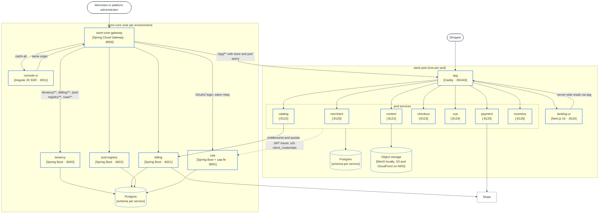
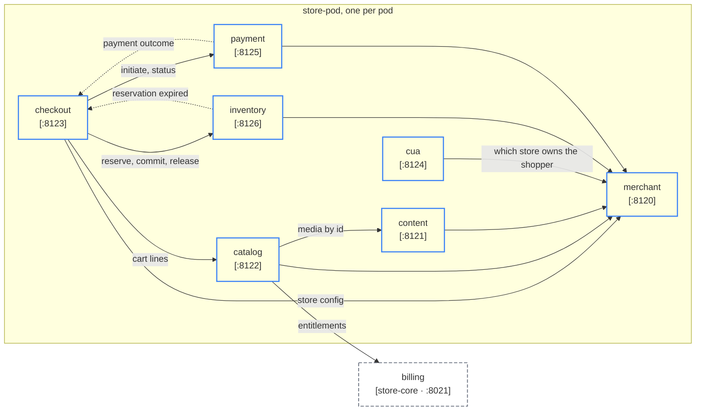

# Containers

The fifteen deployable units, their ports, and the calls between them (C4 level 2).

Two boundaries. `store-core` runs once per environment: six containers and one Postgres. `store-pod` runs once per pod: nine containers, one Postgres and one object store. Every pod is a complete, isolated copy; nothing in a pod is shared with another pod. The shapes follow the [legend](/architecture/system-context#legend).

## Diagram C2

What the edges mean:

- **console-ui → gateway.** The console is served by the gateway's catch-all route and calls the platform APIs on the same origin under `/tenancy/**`, `/billing/**`, `/pod-registry/**` and `/uaa/**`. It holds no token; the gateway's session does.
- **gateway → tenancy, billing, pod-registry, uaa.** `GatewayRouteLocatorImpl` strips the prefix and relays the signed-in user's token (`tokenRelay()`). The `/uaa/**` route alone keeps its prefix and adds `X-Forwarded-Prefix: /uaa`.
- **gateway → spg.** `PodClient` builds one route per pod at runtime: `/spg/**` with `store=` and `pod=` query parameters, `StripPrefix=1`, `TokenRelay`. This is how a merchant edits a product that lives in any pod through one origin. See [Gateway routing](/architecture/gateway-routing).
- **spg → pod services and landing-ui.** The Caddyfile path-routes `/content*`, `/merchant*`, `/inventory*`, `/catalog*`, `/checkout*`, `/cua*`, `/payment*`; everything else goes to `landing-ui` after `domain_lookup` has injected the store headers. See [store-pod](/architecture/store-pod) and [Edge and custom domains](/architecture/edge-spg).
- **landing-ui → spg (server-side).** The storefront's server renders read merchant, content, catalog, checkout and inventory through the pod's own spg (`INTERNAL_SPG`), so a server-side read and a browser-side call take the same route.
- **pod services → uaa.** Every pod service is a JWT resource server that accepts tokens from `uaa` (staff) and `cua` (shoppers), and authenticates to its peers with a `client_credentials` client against `uaa`. See [Authentication](/architecture/authentication).
- **catalog → billing.** `catalog-core` guards product writes with `StoreEntitlements` from `billing-external-api`. It is the one call from a pod back into `store-core`.
- **payment → Stripe, billing → Stripe.** Store payments and platform subscriptions; each receives Stripe's webhooks on its own public endpoint.

## The fifteen containers

| Container | Layer | Port | Runtime | Owns | Fronted by |
|---|---|---|---|---|---|
| `store-core-gateway` | store-core | 8000 | Spring Cloud Gateway (WebFlux) | The browser session, the OAuth2 client login against `uaa`, token relay, the per-pod route table | itself (`gateway.com`) |
| `uaa` | store-core | 8001 | Spring Boot, embeds Angular `uaa-fe` | Staff and merchant identity: OAuth2 authorization server and OIDC provider, users, roles, clients, brokered login, its admin app | `store-core-gateway` (`/uaa/**`); its own host `uaa.gateway.com` |
| `console-ui` | store-core | 8011 | Angular 20 SSR | The merchant and platform-admin console | `store-core-gateway` (catch-all) |
| `tenancy` | store-core | 8020 | Spring Boot | Organizations, stores, members, sign-up, the store → pod binding, store provisioning through the outbox | `store-core-gateway` (`/tenancy/**`) |
| `billing` | store-core | 8021 | Spring Boot | Plans, per-store subscriptions, the Stripe webhook, entitlements and store quotas | `store-core-gateway` (`/billing/**`) |
| `pod-registry` | store-core | 8022 | Spring Boot | The pod catalog: identity, endpoint, health, capacity, placement | `store-core-gateway` (`/pod-registry/**`) |
| `spg` | store-pod | 80 / 443 | Caddy | On-demand TLS for custom domains, domain → store lookup, path routing into the pod | itself (the store's host) |
| `landing-ui` | store-pod | 8110 | Next.js 16 / React 19 | The storefront: one app, every theme, the page cache | `spg` (fall-through) |
| `merchant` | store-pod | 8120 | Spring Boot | Store configuration: languages, currency, domains, address; the routing hooks spg calls | `spg` (`/merchant*`) |
| `content` | store-pod | 8121 | Spring Boot | Pages, posts, banners, FAQ, policies, menus, media library, site settings and appearance | `spg` (`/content*`) |
| `catalog` | store-pod | 8122 | Spring Boot | Products, variants, options, categories, brands, product types and groups, images | `spg` (`/catalog*`) |
| `checkout` | store-pod | 8123 | Spring Boot | Cart, orders, customers, countries | `spg` (`/checkout*`) |
| `cua` | store-pod | 8124 | Spring Boot | Shopper identity: a headless OAuth2 authorization server, registration, social login | `spg` (`/cua*`, prefix kept) |
| `payment` | store-pod | 8125 | Spring Boot | Payment provider configuration per store, payment execution, provider webhooks | `spg` (`/payment*`) |
| `inventory` | store-pod | 8126 | Spring Boot | Stock, prices and reservations, keyed by sku | `spg` (`/inventory*`) |

Ports, hostnames and the fronting gateway (`gateway-service-name`) are recorded per service in `common-config.yml`. A service is reachable on its own port only inside its namespace (`store-core.cvhome.lcl`, `store-pod-<id>.cvhome.lcl`); from anywhere else it is a path on its gateway, with the prefix stripped (except `/cua` and `/uaa`).

## Service to service

Diagram C2 draws how a request reaches a service. It does not draw what the services then ask each other,
and that is a different graph: a request for a cart page fans out to four services before it answers.

Every edge below is one module depending on another domain's `-external-api`, which is the only sanctioned
way a service may call a peer. The interface lives with the provider, the provider's `External*Api`
controller implements it, and the caller consumes it through `RestClientBuilder`. Nothing calls another
service's `-core` or `-service` module, so this table is the complete set: a new edge cannot appear without
a new dependency in a `build.gradle`.

### Inside a pod

Solid is a call the caller waits for; dashed is a signal delivered after the fact, from an outbox or a
scheduled job. Shapes follow the [legend](/architecture/system-context#legend).

Two things the picture says that the prose should not bury.

**`merchant` is the hub of a pod.** Six of the nine services call it, all for the same thing: the store's
configuration, through `ExternalMerchantStoreService.getStore`. It is also what `spg` asks on every cold
request, to turn a host name into a store and to decide whether to issue a certificate
([edge and custom domains](/architecture/edge-spg)). Nothing else in a pod is depended on so widely, so
`merchant` being slow is the pod being slow, and `merchant` being down is the pod being down.

**`checkout` is called back, not just calling.** Placing an order reserves stock and starts a payment, and
both of those finish later, so `inventory` and `payment` call `ExternalOrderSignalService` on `checkout`
when they do. The order is the thing that survives; the signals move it along. That is why the order path
reads as durable rather than as one long transaction ([store-pod](/architecture/store-pod)).

### Across the layers

A pod reaching into `store-core` happens in exactly one place. `catalog` asks `billing` for a store's
entitlements before a product write, which is why `lcl-config.yml` carries a namespace-qualified alias for
the platform gateway. Everything else crossing the boundary goes the other way, from `store-core` into a
pod.

| Caller | Callee | Contract | What it is for |
|---|---|---|---|
| `store-core-gateway` | `pod-registry` | `ExternalPodService.listPods` | The pod list that becomes the `/spg/**` routes, refreshed every minute ([gateway routing](/architecture/gateway-routing)) |
| `store-core-gateway` | `billing` | `ExternalEntitlementService.snapshot` | `StoreBillingGuardFilter` answers 402 on a seller write when the store is not entitled |
| `tenancy` | `billing` | `ExternalStoreQuotaService.checkStoreCreate`, `provision` | May this organization create another store, and the new store's subscription. A refusal is a 422 |
| `tenancy` | `pod-registry` | `ExternalPodPlacementService.place` | Which pod a new store is placed in |
| `tenancy` | `merchant` in the target pod | `MerchantStorePodClient.create` | Creates the store inside the chosen pod, driven by the outbox ([tenancy and provisioning](/architecture/tenancy-provisioning)) |
| `catalog` | `billing` | `ExternalEntitlementService.snapshot` | The store's entitlements before a product write. The only pod-to-core call |

### The calls inside a pod

| Caller | Callee | Contract | What it is for |
|---|---|---|---|
| `checkout` | `catalog` | `ExternalProductService` (`/cart-lines`, `/detailed-product`) | Product data for the lines in a cart |
| `checkout` | `inventory` | `ExternalProductReservationService` (`reserve`, `commit`, `release`) | The stock reservation lifecycle behind an order |
| `checkout` | `payment` | `ExternalPaymentGatewayService` (`initiatePayment`, `status`) | Starts a payment and reads its outcome |
| `catalog` | `content` | `ExternalMediaService.resolve` | Media assets by id, and their usage |
| `inventory` | `checkout` | `ExternalOrderSignalService.signalReservationExpired` | A reservation expired; the expiry job tells the order |
| `payment` | `checkout` | `ExternalOrderSignalService.signalPayment` | The payment outcome reaches the order, delivered from payment's outbox |
| `cua` | `merchant` | `ExternalMerchantStoreService.getStore` | Which store owns the shopper signing in |
| `catalog`, `checkout`, `content`, `inventory`, `payment` | `merchant` | `ExternalMerchantStoreService.getStore` | The store's configuration: languages, currency, domains |

Every one of these carries a `client_credentials` token minted by `uaa` for the calling service, and every
one names its failure contract when the client is built, so a peer being unavailable is a typed exception
rather than a stack trace ([authentication](/architecture/authentication)).

## Data

Each Spring Boot service owns one Postgres schema, named after the application (`pod_registry`, `content`, `payment`, ...), and ships its own DDL as a `schema.sql`. Foreign keys never cross a schema. `store-core` shares one Postgres; each pod has its own. `content`, `merchant` and `payment` configure an S3 client for files (MinIO locally; S3 behind CloudFront on AWS), and `spg` keeps its certificates in an S3 bucket.

## Shared libraries

`store-commons/` is libraries only; nothing in it is deployed. Every service inherits its cross-cutting behavior by depending on these modules:

| Module | What it gives a service |
|---|---|
| `commons` | The value objects used everywhere in place of raw strings: `StoreMerchantId`, `ManagerOrgId`, `PodId`, `LanguageCode`, `Pod`, `PodEndpoint`, `Theme`, ... |
| `errors` | The shared error catalog and `ProblemDetail` handling |
| `autoconfigure` | Multi-issuer JWT decoding, the permission evaluator, web clients, and the shared YAML (`common-config.yml`, `lcl-config.yml`, `fargate-config.yml`) |
| `uaa-client`, `uaa-client-impl` | A typed SDK for `uaa`'s admin API |
| `sso/sso-core`, `sso/sso-events` | The authorization-server core that `uaa` and `cua` are both built on |
| `secret-crypto/*` | Encryption of stored secrets (payment keys, social-login credentials): local AES or AWS KMS, with a caching decorator |
| `ecs-commons/*` | Cloud Map service discovery and ECS task metadata for Fargate; inert locally |
| `test-support` | Testcontainers, test JWT signing and the integration-test annotations; never on a production classpath |
| `ui-kit` | The Angular component kit `console-ui` and `uaa-fe` share |

A second module is also called `store-commons`: `store-pod/commons/store-commons` is the pod-scoped shared domain. Refer to either by its Gradle path.

## Images

Container images are named `<layer>/<service>`: `store-core/uaa`, `store-core/console-ui`, `store-pod/catalog`, `store-pod/spg`, and so on. Nothing deploys from the application repository's CI; images build in CodeBuild and Terraform applies them. See [Deployment: AWS](/architecture/deployment-aws) and [Deployment: local](/architecture/deployment-local).

---

*Source of truth: cvhome `store-commons/autoconfigure/src/main/resources/common-config.yml`, `store-pod/spg/Caddyfile`, `store-core/gateway/gateway-service/src/main/java/com/asrevo/cvhome/gateway/config/GatewayRouteLocatorImpl.java`, `store-core/gateway/gateway-service/src/main/java/com/asrevo/cvhome/gateway/client/PodClient.java`, `.claude/skills/project-structure/SKILL.md` and `references/{store-core,store-pod,shared-libraries,database-schemas,service-to-service}.md`, `store-pod/catalog/catalog-core` (`StoreEntitlements`), `store-pod/landing-ui/libs/services/src/store-context-ssr-utils.ts`.*
