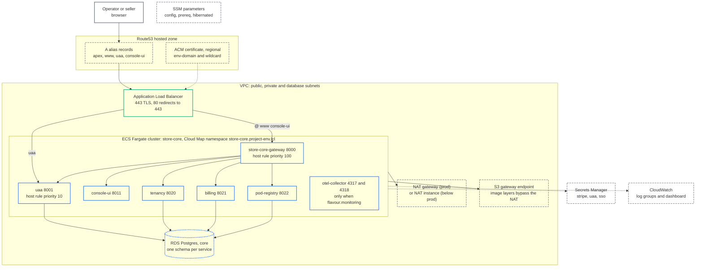
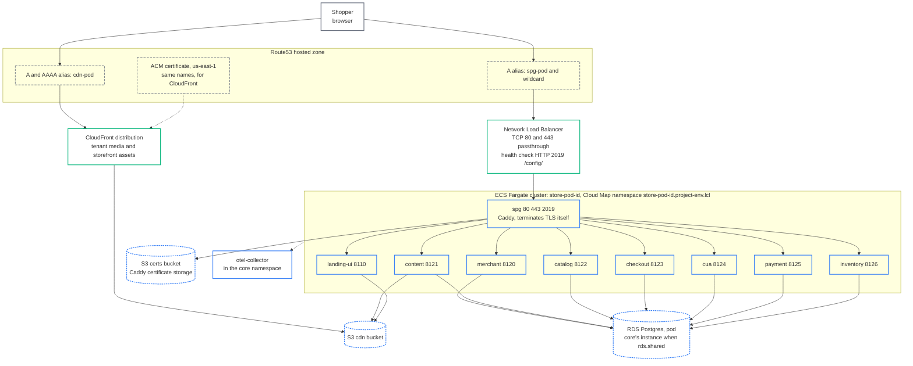

# Deployment: AWS

What one environment is made of on AWS and how the pipeline builds and applies it (C4 deployment view).

One CloudFormation stack is one environment. It writes the environment's configuration to SSM, creates the
Terraform state bucket, the secrets and the CodeBuild projects, and starts a three-stage pipeline that applies
everything else with Terraform. The result is one **core** layer (six ECS services behind an ALB) and one or more
**pods** (nine ECS services each, behind their own NLB), sharing one VPC. Legend:
[system context](/architecture/system-context#legend).

## One environment: the core layer and the shared pieces



Facts behind the boxes:

- **ALB.** One per environment, in the public subnets. The 443 listener carries the regional ACM certificate;
  the 80 listener is a redirect to 443. TLS ends at the ALB: every core target group is HTTP on the container
  port. Host rules come from `services.yaml` `edge` blocks: `store-core-gateway` owns `@`, `www` and
  `console-ui` at priority 100, `uaa` owns `uaa` at priority 10. `console-ui` is not exposed directly; the
  gateway routes that host to it.
- **Core cluster.** Six catalog services on Fargate, each with a Cloud Map service in the
  `store-core.<project>-<env>.lcl` private DNS namespace, a security group, a task role and a log group. The
  otel-collector is a seventh, infrastructure-only service that exists when the flavour says `monitoring: true`.
- **Core RDS.** One Postgres instance; every service owns a schema named after itself. Below prod with
  `rds.shared`, the default pod's services use this same instance.
- **Shared pieces.** Three Secrets Manager secrets (`/<project>/<env>/stripe`, `/uaa`, `/sso`) bound to tasks by
  ARN; SSM `/<project>/<env>/config` (what the bootstrap generated) and `/prereq` (what the prereq state
  published); a NAT gateway in prod or one `t4g.nano` NAT instance below prod; an S3 gateway endpoint so image
  pulls do not cross the NAT; one CloudWatch dashboard per environment where the flavour has `dashboard: true`.

## One pod

Every environment has a default pod (id `507f1f77bcf86cd799439011`, so its hostname is `spg-507f1f77`), plus
`PodCount` additional pods. Each pod is the block below, repeated.



- **NLB.** TCP listeners on 80 and 443 forward to spg unchanged, so Caddy terminates TLS and can mint
  on-demand certificates for tenant domains. The health check is HTTP against Caddy's admin API on 2019,
  path `/config/`. The pod's record and a wildcard under it (`*.spg-<id>.<env-domain>`) alias the NLB, which
  is how every custom tenant hostname on the pod resolves. The NLB writes no access logs: TCP listeners
  have none.
- **spg.** Runs the `store-pod/spg` image (built in cvhome on top of `saas-gateway`), with `ASK_TLS_URL` and
  `DOMAIN_LOOKUP_URL` pointing at merchant inside the pod namespace, `ACME_CA_URL` at Let's Encrypt, and
  `CERT_BUCKET` at the pod's certs bucket so every spg task shares one certificate store.
- **CDN.** One S3 `cdn` bucket and one CloudFront distribution per pod, reached through an origin access
  control. The Spring services with `cdn: true` write tenant media to it; landing-ui pushes its own static
  build output to it at container start (`STATIC_ASSETS_*`) and serves it from CloudFront. The distribution's
  alias is `cdn-<id>.<env-domain>` with A and AAAA records, covered by the us-east-1 certificate; until the
  prereq state has published that certificate the pod falls back to the CloudFront default domain.
- **Pod RDS.** Its own instance in staging and prod. In `dev` and `ephemeral` (`rds.shared: true`) the
  default pod uses core's instance; additional pods always get their own, because their schemas would collide
  with the default pod's.
- **Telemetry.** Pod tasks export to `otel-collector.store-core.<project>-<env>.lcl` across the namespace
  boundary; both namespaces are private hosted zones on the same VPC. See
  [monitoring](/operations/monitoring).

The build and apply chain that produces all of this is drawn on the [pipeline page](/operations/pipeline)
(diagram D2).

## Flavours

`flavours.yaml` names four environment shapes. One name fixes task sizes, desired counts, capacity policy, RDS
class and backups, log retention, monitoring and networking together; `envs/<env>.tfvars` can override any key
with `flavour_overrides`, merged one level deep into `rds`, `capacity`, `sizes` and `network`.

| Key | dev | staging | prod | ephemeral |
|---|---|---|---|---|
| Purpose | cheapest thing that runs the whole product | prod's shape at a fraction of its size | tenant data lives here | throwaway for a branch or a demo |
| `sizes` (cpu/memory) | gateway, medium, ssr 512/1024; small 256/1024; ui 256/512 | gateway, medium, ui, ssr 512/1024; small 256/1024 | gateway, medium 1024/2048; small, ui, ssr 512/1024 | gateway, medium, small 256/1024; ui, ssr 256/512 |
| `desired_count` | 1 | 1 | 2 | 1 |
| `autoscaling` | off (landing-ui scales 1 to 3 on its own) | on, 1 to 3, CPU 75 | on, 2 to 12, CPU 55, memory 70, 800 requests per target | off (landing-ui scales 1 to 3 on its own) |
| `protected` | false | false | true | false |
| `capacity` | Spot only | Spot only | on-demand base 1, 50 percent | Spot only |
| `rds.instance_class` | db.t4g.micro | db.t4g.small | db.t4g.small | db.t4g.micro |
| `rds.shared` | true | false | false | true |
| `rds.db_pool_size` | 3 | 6 | 6 | 3 |
| `rds` backups, deletion protection, final snapshot | 0 days, off, skipped | 1 day, off, skipped | 7 days, on, taken | 0 days, off, skipped |
| `monitoring` (collector, Container Insights) | false | true | true | false |
| `dashboard` | true | true | true | false |
| `log_retention_days` | 7 | 14 | 30 | 1 |
| `log_class` | INFREQUENT_ACCESS | INFREQUENT_ACCESS | STANDARD | INFREQUENT_ACCESS |
| `network.egress` | nat_instance (t4g.nano) | nat_instance (t4g.nano) | nat_gateway | nat_instance (t4g.nano) |
| `storefront_previews` | true | true | false | true |
| `cdn_price_class` | PriceClass_100 | PriceClass_100 | PriceClass_All | PriceClass_100 |
| `static_asset_retention_days` | 30 | 30 | 180 | 7 |
| `health_check_grace_seconds` | 90 | 120 | 180 | 90 |

`protected` drives load balancer deletion protection and whether buckets may be force-destroyed. The Spring
task floor is 1024 MB because the buildpack JVM reserves about 680 MB before any heap; only the Node UIs fit
in 512 MB. `network.egress` may also be `public_ip`, which puts a public address on every task and removes
the NAT.

## Guards in `main.tf`

`terraform_data.guards` fails the plan with a sentence instead of failing mid-apply with an AWS error:

| Guard | Rule |
|---|---|
| Pod prefix | The first 8 characters of every pod id must be unique; they name the namespace, load balancer, database and DNS record |
| Name length | `project` + `env` must be 34 characters or fewer |
| Hibernate | A protected flavour cannot be hibernated |
| Image tag | A protected flavour refuses `image_tag = "latest"`; it must be a released `X.Y.Z` |
| Certificate | `app_domain` in the prereq state must equal the domain this environment serves, or prereq must be re-applied |
| Connections | A rolling deploy (2 x pool size x task floor x database services, both layers when shared) must fit the instance class: about 80 on db.t4g.micro, 190 on db.t4g.small, 400 on db.t4g.medium |

## Hostnames

Below prod every hostname sits under an environment label, so several environments can share one hosted zone.
The label is the environment name unless `dns_prefix` overrides it in both roots; prod uses the bare apex.

| Environment | Console | uaa | Pod | CDN |
|---|---|---|---|---|
| prod | `console-ui.example.com` | `uaa.example.com` | `spg-<id>.example.com` | `cdn-<id>.example.com` |
| staging | `console-ui.staging.example.com` | `uaa.staging.example.com` | `spg-<id>.staging.example.com` | `cdn-<id>.staging.example.com` |
| dev | `console-ui.dev.example.com` | `uaa.dev.example.com` | `spg-<id>.dev.example.com` | `cdn-<id>.dev.example.com` |

The prereq state mints one regional certificate for `<env-domain>` and `*.<env-domain>` (the ALB) and one in
us-east-1 for the same names (CloudFront), and `main.tf` asserts that the two roots agree before it applies.
`terraform output console_url` prints `https://console-ui.<env-domain>`.

## State

Two Terraform states per environment in the bucket the bootstrap created
(`<project>-<env>-tfstate-<account>-<region>`, versioned, retained when the stack is deleted):

```
prereq/<env>/terraform.tfstate    ECR repositories and the two certificates
env/<env>/terraform.tfstate       everything else
```

The split exists because ECR does not create repositories on push and the ALB cannot reference an unissued
certificate, so both must exist before the image build and the environment apply. Both states use S3 native
locking (`use_lockfile = true`, Terraform 1.10 or later); there is no DynamoDB table. Bucket, key and region
are passed with `-backend-config` by the CodeBuild projects.

Configuration layers as `flavours.yaml` < SSM `/<project>/<env>/config` < `envs/<env>.tfvars`: the flavour is
the default, SSM holds what the bootstrap generated (zone, pod ids, the version typed into the stack) and the
tfvars hold what a human chose and win.

To stand one of these up from an empty account, follow the [deployment guide](/operations/deployment-guide).

---

*Source of truth: cvhome-platform `modules/*`, `services.yaml`, `flavours.yaml`, `main.tf`, `backend.tf`,
`variables.tf`, `envs/*.tfvars`, `prereq/main.tf`, `bootstrap/bootstrap.yaml`, `README.md`.*
