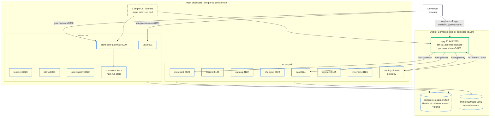

# Deployment: local

What `lcl start` runs on a laptop, in which order, and how the host names reach it (C4 deployment view).

`lcl` is the org's local stack runner. It reads `lcl.yml` at the root of the cvhome checkout, starts three
Docker Compose containers, then supervises 12 Spring services, the Angular console, the Next.js storefront and
five Stripe CLI listeners as host processes, in dependency order, each with a health check. Legend:
[system context](/architecture/system-context#legend).

## The stack



### Containers

| Container | Image | Ports | Notes |
|---|---|---|---|
| `postgres` | `postgres:15-alpine` | 5432 | database `cvhome`; a named volume, so a plain `lcl stop` keeps the data and `lcl stop --hard` discards it |
| `minio` | `quay.io/minio/minio:RELEASE.2025-09-07T16-13-09Z-cpuv1` | 9000 API, 9001 console | object storage for media; named volume |
| `spg` | `ashraf1abdelrasool/saas-gateway:sha-4a6d381` | 80, 443, 2019 | `store-pod/spg/Caddyfile` mounted at `/etc/caddy/Caddyfile`; `extra_hosts` map every `*.gateway.com` upstream to `host-gateway`, so Caddy proxies to the services running on the host |

spg is a container but also a routed service: `LCL_PORT_*` variables tell the Caddyfile which host ports to
proxy to and what `X-Forwarded-Port` to set, and its two self-addressed lookup URLs (`ASK_TLS_URL`,
`DOMAIN_LOOKUP_URL`) point at `spg-507f1f77.gateway.com` on its own port.

### Host processes

Every Spring service runs as

```bash
./gradlew :<module>:bootRun --args=--spring.profiles.active=lcl,test-stores --project-cache-dir=<stack>/gradle
```

`lcl` is the environment slice (datasource, discovery, MinIO) and `test-stores` seeds the demo organizations,
stores and users the local host names point at. The console runs `npm run start` in `store-core/console-ui`
after building `store-commons/ui-kit`; the storefront runs `npx next dev --turbopack` in
`store-pod/landing-ui/storefront` after building its libs. Each service gets one `SPRING_APPLICATION_JSON`
override that rewrites every `com.asrevo.cvhome.services.<name>.port` and every simple-discovery instance URI
from the port map lcl assigned, which is what keeps a shifted stack coherent.

The five Stripe CLI listeners (`stripe-billing-webhook` and one per seeded store) open an outbound websocket
to Stripe and forward events to the gateway or through spg. They need `stripe login` once; without it they
show as crashed and nothing else is affected.

## Start order

`depends-on` in `lcl.yml` is the DAG the supervisor follows. A service starts only when everything it depends
on is healthy.

| Service | Depends on |
|---|---|
| `uaa` | `postgres` |
| `store-core-gateway`, `tenancy`, `billing`, `pod-registry` | `uaa`, `postgres` |
| `console-ui` | `store-core-gateway` |
| `merchant`, `content`, `catalog`, `checkout`, `payment`, `inventory` | `uaa`, `postgres`, `minio` |
| `cua` | `uaa`, `postgres` |
| `landing-ui` | `spg`, `merchant`, `content`, `catalog`, `checkout`, `inventory` |
| `stripe-billing-webhook` | `store-core-gateway`, `billing` |
| `stripe-<store>-webhook` (four) | `spg`, `payment` |

Spring health is `/actuator/health` expecting `"status":"UP"`, or the `Started ...Application` log line; the
timeout is 600 s because a fresh worktree compiles the whole project before uaa, the first service, can bind
a port. The two UIs use a TCP check with a 300 s timeout.

## Host names

`lcl.yml` lists 19 names under `gateway.com` that must resolve to the loopback address: the apex, `www`,
`uaa`, `console-ui`, `spg-507f1f77`, one per pod service (`catalog`, `merchant`, `content`, `checkout`, `cua`,
`payment`, `inventory`, `landing-ui`), the seeded storefronts (`org1-store1`, `org1-store2`, `org2-store1`,
`org2-store2`, `org3-store1`, all under `spg-507f1f77.gateway.com`) and `spg-org3.gateway.com`.

```bash
sudo ./extra/scripts/configure-domain.sh   # appends the 127.0.0.1 entries to /etc/hosts, once
lcl doctor                                 # reports which of the lcl.yml hosts are missing
```

lcl only checks the entries; the script writes them (it also adds `k6-local.spg-507f1f77.gateway.com` for
the load-testing suite).

## Named stacks and ports

The ports above are the canonical ones from `common-config.yml`. `lcl start --stack <name>` runs a second
stack beside the first with every port shifted by `ports.step: 1000` times the stack index, so two worktrees
can serve different branches at once. Because uaa's seeded `web-app` client carries redirect URIs on the
canonical gateway port, a `hooks.after-up` step rewrites that row in Postgres whenever the offset is not 0.
`/actuator/info` on every Spring service reports `INFO_STACK_NAME`, `INFO_STACK_WORKTREE` and
`INFO_STACK_OFFSET`, which answers "which checkout is serving this port".

## No telemetry locally

The dev stack has no collector: `otel.sdk.disabled: true` and nothing exports. The platform-as-images stack
with collector, Prometheus, Loki, Tempo and Grafana lives in the load-testing repo (`make stack-up` there), and
that is where load numbers are taken.

## Entry points

| What | URL |
|---|---|
| Seller console | `http://gateway.com:8000` |
| uaa | `http://uaa.gateway.com:8001` |
| Storefront | `http://org1-store1.spg-507f1f77.gateway.com` |
| MinIO console | `http://localhost:9001` |
| Postgres | `postgresql://localhost:5432/cvhome` |

`lcl urls` prints the same list with the ports of the stack you started. The developer workflow around this
stack is on [local development](/development/local-development).

---

*Source of truth: cvhome `lcl.yml`, `docker-compose-lcl.yml`, `extra/scripts/configure-domain.sh`; lcl
`src/commands/doctor.ts`.*
