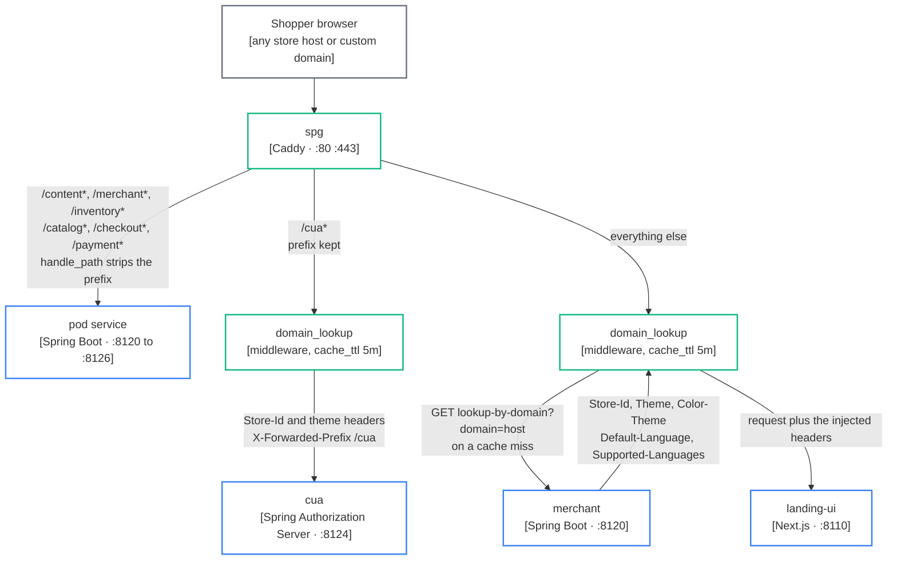
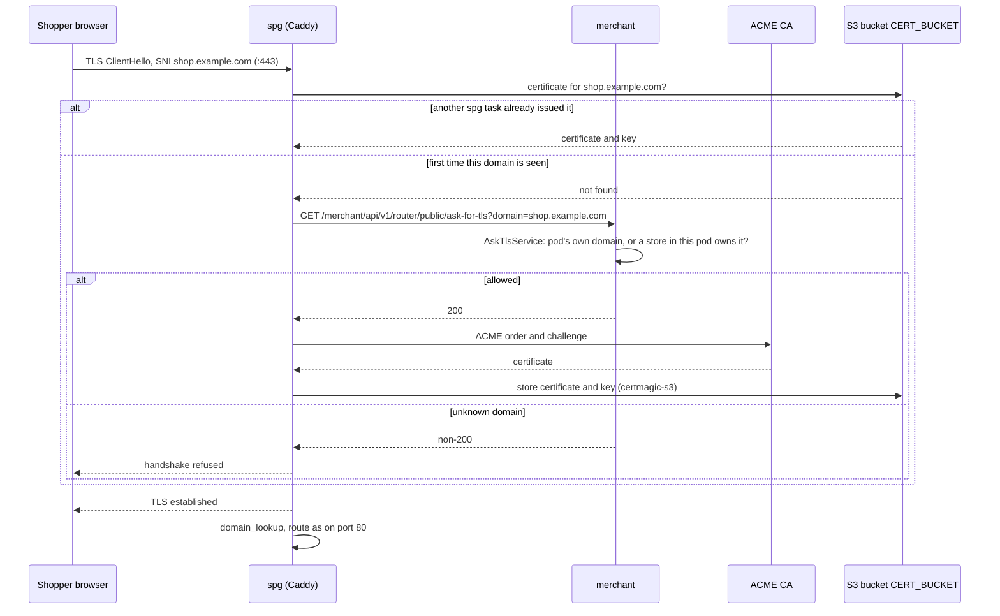

# Edge and custom domains

How spg turns a shopper's host name into a store, injects the tenant headers, and issues a certificate on demand (C4 level 3).

spg is a Caddy server, one per pod, on ports 80 and 443. Its whole configuration is one Caddyfile in `store-pod/spg/`. It does three jobs: resolve the host name to a store, route paths to the pod's services, and terminate TLS for any domain a merchant points at it. Legend: [system context](/architecture/system-context#legend).

## A shopper request



### Host name to store: `domain_lookup`

`domain_lookup` is a Caddy HTTP middleware from the `caddy-domainlookup` repository. On each request it takes the host name (port stripped), and on a cache miss calls `lookup_url` with `?domain=<host>`. That URL is merchant's `GET /merchant/api/v1/router/public/lookup-by-domain`, answered by `LookupDomainHeadersService`, which finds the store that owns the domain **in this pod** and returns a flat JSON map. Every key becomes a request header:

| Header | Meaning |
|---|---|
| `Store-Id` | the store's `StoreMerchantId` |
| `Theme` | which landing-ui theme renders this store |
| `Color-Theme` | the store's palette |
| `Default-Language`, `Supported-Languages` | i18n |

Results are cached per host for `cache_ttl` (`DOMAIN_LOOKUP_TTL`, `5m` in both compose and the Caddyfile default; the middleware's own fallback is ten minutes). The middleware **fails open**: if the lookup errors or returns a non-200, it logs and passes the request through with no headers, and the upstream decides what an unknown host gets.

landing-ui is one deployment for every store in the pod. These headers are the only way it learns which tenant it is rendering. `/cua*` runs the same middleware so cua learns the shopper's store from `Store-Id` rather than from a form field the request could choose.

### The route table

| Path | Directive | Upstream | Prefix |
|---|---|---|---|
| `/content*` | `handle_path` | `content.{$NAMESPACE}:8121` | stripped |
| `/merchant*` | `handle_path` | `merchant.{$NAMESPACE}:8120` | stripped |
| `/inventory*` | `handle_path` | `inventory.{$NAMESPACE}:8126` | stripped |
| `/catalog*` | `handle_path` | `catalog.{$NAMESPACE}:8122` | stripped |
| `/checkout*` | `handle_path` | `checkout.{$NAMESPACE}:8123` | stripped |
| `/cua*` | `handle` + `route { domain_lookup; reverse_proxy }` | `cua.{$NAMESPACE}:8124` | **kept**, `header_up X-Forwarded-Prefix /cua` |
| `/payment*` | `handle_path` | `payment.{$NAMESPACE}:8125` | stripped |
| everything else | `route { domain_lookup; reverse_proxy }` | `landing-ui.{$NAMESPACE}:8110` | none |

`{$NAMESPACE}` is `gateway.com` under lcl and the pod's Cloud Map namespace on AWS; the table itself never changes between environments. Each upstream port has an `{$LCL_PORT_<SVC>:default}` placeholder so lcl can shift ports for a named stack.

`/cua*` keeps its prefix because the cua issuer that every pod service trusts is the spg-fronted URL ending in `/cua` ([authentication](/architecture/authentication)). cua reads `X-Forwarded-Prefix` in `PathPrefixFilter` and reports it as its context path, so `/cua/login` maps to `/login` inside and every absolute URL it builds carries the prefix back out. `domain_lookup` sits inside a `route` block in both places because it is not an ordered handler and Caddy refuses it directly under `handle`.

### Headers and encoding at the edge

- **`request_header X-Forwarded-Port {args[0]}`** per site: Caddy sends `X-Forwarded-Proto` and `X-Forwarded-Host` but never the port, and Tomcat's `RemoteIpValve` (`forward-headers-strategy: NATIVE`) drops the port from `X-Forwarded-Host` and falls back to 80/443. cua derives the shopper login `redirect_uri` from the request, so without this header the redirect would not match on any non-default port. The `routes` snippet is imported once per site with that site's public port (`{$LCL_PORT_SPG:80}`, `{$LCL_PORT_SPG_TLS:443}`).
- **`encode zstd gzip`**: Spring Boot leaves `server.compression` off and landing-ui sets `compress: false` in `next.config.ts`, so the edge is the one place compression happens. Streamed responses stay streamed, and anything already carrying `Content-Encoding` is skipped.
- **`tracing { span <service> }`** on every route names the span after the upstream, and every route adds `X-Trace-Id` and `X-Span-Id` response headers from `{http.vars.trace_id}` / `{http.vars.span_id}`, so a shopper-visible failure can be looked up in Tempo by id.
- **Admin API on 2019** (`admin 0.0.0.0:2019`). On AWS the pod NLB health-checks spg at `:2019/config/` (`cvhome-platform/services.yaml`, `edge.health_check`). A Caddy that has loaded its config answers; one that has not, does not.

## On-demand TLS for a custom domain



The Caddyfile's global block wires this together:

```
storage s3 { bucket {$CERT_BUCKET}  region {$CERT_BUCKET_REGION} }
on_demand_tls { ask {$ASK_TLS_URL} }
acme_ca {$ACME_CA_URL:https://acme-staging-v02.api.letsencrypt.org/directory}
```

and the `https://` site declares `tls { on_demand }`. What each part does:

- **`ask`** is the gate. Caddy will not start an ACME order until `ASK_TLS_URL` answers 200 for the domain. That URL is merchant's `ask-for-tls`, and `AskTlsService` says yes only for the pod's own domain or a domain a store **in this pod** has allocated. One pod can never mint a certificate for another pod's tenant, and an attacker cannot exhaust the CA's rate limits by pointing random names at the edge. Locally `ASK_TLS_URL` points back through spg itself (`http://spg-507f1f77.gateway.com:80/merchant/...`); on AWS it goes straight to `merchant.${namespace}`.
- **`storage s3`** comes from the `certmagic-s3` module, which stores CertMagic's certificates, keys and locks in an S3-compatible bucket. Every spg task in the pod shares the bucket, so a certificate issued by one task is served by all of them and a task restart does not re-issue. The bucket is created per pod by `cvhome-platform/modules/store-pod/storage.tf` (`aws_s3_bucket.certs`, versioned).
- **`acme_ca`** defaults to Let's Encrypt staging; `services.yaml` sets the production directory for AWS pods.

## The image chain

spg's binary is built outside the app repo and pinned in it:

1. **`caddy-domainlookup`** (the `domain_lookup` middleware) and **`certmagic-s3`** (the `s3` storage module) are Go modules in their own repositories.
2. **`saas-gateway`** compiles both into Caddy with `xcaddy build --with github.com/cvhome-saas/certmagic-s3 --with github.com/cvhome-saas/caddy-domainlookup` on `golang:1.25-alpine`, copies the binary onto `alpine:3.19`, grants `cap_net_bind_service`, and runs `caddy run --config /etc/caddy/Caddyfile`. A push to `main` publishes it to Docker Hub as `saas-gateway:latest` and `saas-gateway:sha-<short sha>` (`docker/metadata-action`, `type=sha`).
3. **`public-dkr`** mirrors the chosen `sha-<short>` tag from Docker Hub to the org's public ECR, `public.ecr.aws/b2i4h4k9`, alongside the other allow-listed base images.
4. **`cvhome/store-pod/spg/Dockerfile`** is four lines: `FROM public.ecr.aws/b2i4h4k9/ashraf1abdelrasool/saas-gateway:sha-<short>`, `COPY Caddyfile /etc/caddy/Caddyfile`, expose 80, 443 and 2019. Under lcl the compose file runs the Docker Hub image directly and bind-mounts the same Caddyfile.

A change to either plugin therefore travels: plugin repo, saas-gateway build, public-dkr mirror, then a pin bump in cvhome. The repositories and who owns each step are on [repositories](/guide/repositories).

---

*Source of truth: cvhome `store-pod/spg/Caddyfile`, `store-pod/spg/Dockerfile`, `docker-compose-lcl.yml`; cvhome `store-pod/merchant/merchant-service/src/main/java/com/asrevo/cvhome/merchant/api/v1/RouterController.java`, `service/{AskTlsService,LookupDomainHeadersService}.java`; cvhome `store-commons/sso/sso-core/src/main/java/com/asrevo/cvhome/sso/config/PathPrefixFilter.java`; caddy-domainlookup `domainlookup.go`; certmagic-s3 `README.md`; saas-gateway `Dockerfile`, `.github/workflows/docker-publish.yml`; public-dkr `.github/workflows/push-images.yml`; cvhome-platform `services.yaml`, `modules/store-pod/storage.tf`.*
