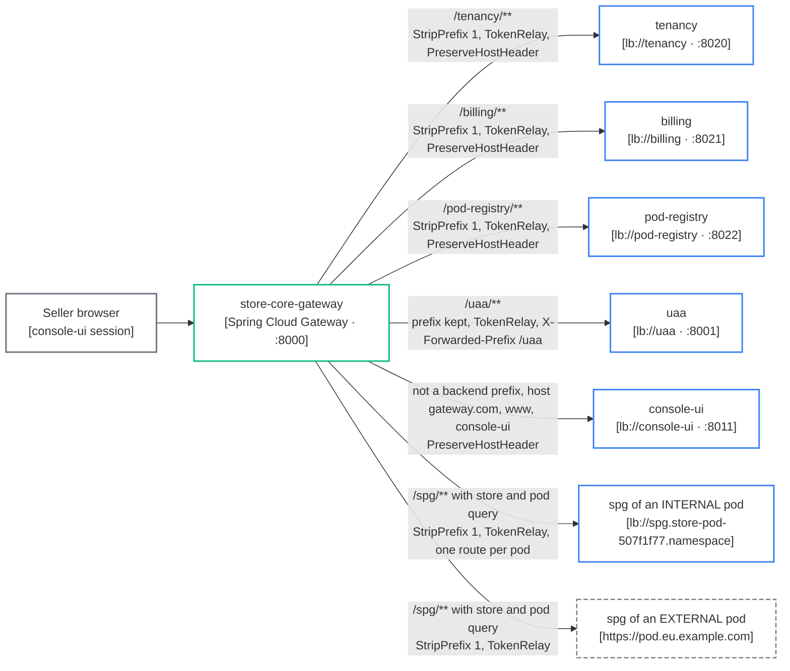
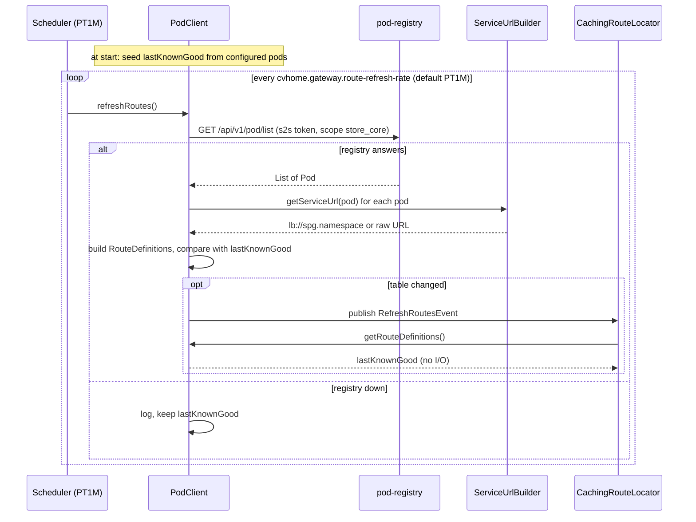

# Gateway routing

How store-core-gateway maps a request to a service, and how it learns the pods at runtime (C4 level 3).

store-core-gateway is a reactive Spring Cloud Gateway on port 8000. It is the only origin the seller console ever talks to. Every route is defined in code: the static ones in `GatewayRouteLocatorImpl`, the per-pod ones generated by `PodClient`. Legend: [system context](/architecture/system-context#legend).

## Request to target



### Static routes

| Predicate | Filters | Target |
|---|---|---|
| `Path=/tenancy/**` | `StripPrefix=1`, `TokenRelay`, `PreserveHostHeader` | `lb://tenancy` |
| `Path=/billing/**` | `StripPrefix=1`, `TokenRelay`, `PreserveHostHeader` | `lb://billing` |
| `Path=/pod-registry/**` | `StripPrefix=1`, `TokenRelay`, `PreserveHostHeader` | `lb://pod-registry` |
| `Path=/uaa/**` | `TokenRelay`, `PreserveHostHeader`, `AddRequestHeader X-Forwarded-Prefix: /uaa` (prefix **kept**) | `lb://uaa` |
| not any backend prefix, and `Host` is `gateway.com`, `www.gateway.com` or `console-ui.gateway.com` | `PreserveHostHeader` | `lb://console-ui` |

The gateway domain comes from `common-config.yml` (`serviceDomainProperties.getService(<gateway>).domain()`), so the same code serves `gateway.com` locally and the real console host on AWS.

`lb://` means Spring Cloud LoadBalancer resolves the instance through the discovery client: fixed host ports under lcl, Cloud Map under Fargate. `PreserveHostHeader` matters because console-ui renders server-side and reads the request `Host` as its own origin; without it the SSR pass would see the task's private IP.

### Runtime routes, one per pod

`PodClient` implements `RouteDefinitionRepository`. For each pod it emits a route with:

| Part | Value |
|---|---|
| Route id | `pod-<first 8 chars of the pod id>` |
| Predicates | `Path=/spg/**`, `Query=store`, `Query=pod,<full pod id>` |
| Filters | `StripPrefix=1`, `TokenRelay` |
| URI | `lb://spg.<pod namespace>` for an `INTERNAL` pod, the raw endpoint URL for an `EXTERNAL` pod (`ServiceUrlBuilder.getServiceUrl(Pod)`) |

So `gateway.com:8000/spg/catalog/api/v1/products?store=<id>&pod=<podId>` loses `/spg`, arrives at the pod's spg as `/catalog/api/v1/products?...`, and spg strips `/catalog` before it reaches catalog on 8122. A seller edits any store in any pod through one origin; the pod is a query parameter. The pod's services accept the relayed seller token because uaa is one of their trusted issuers ([authentication](/architecture/authentication)). The edge side of that second hop is on [edge and custom domains](/architecture/edge-spg).

## Learning the pods



Three details in `PodClient` carry the design:

- **The route table is fetched on a schedule and published, never fetched during lookup.** `getRouteDefinitions()` returns `lastKnownGood` from memory. A slow or dead registry therefore leaves the previous routes serving instead of producing an empty table; an empty table would be every seller request to every pod failing within one refresh period.
- **The table is seeded from configuration** (`ServiceDomainProperties.pods()`) at start-up, so a gateway that boots while pod-registry is down still routes the pods it was configured with. A pod created since is missing until the first successful refresh.
- **A `RefreshRoutesEvent` is published only when the list changed.** Publishing unconditionally made `CachingRouteLocator` rebuild its whole table every minute for nothing.

The pod list comes from pod-registry (`ReactiveExternalPodService.listPods()` in `pod-registry-external-api`, `GET /api/v1/pod/list`), not from tenancy: pods moved to pod-registry in 2026-08 ([tenancy and provisioning](/architecture/tenancy-provisioning)). The call carries the gateway's `s2s` client-credentials token (`store-core@service.store-core.internal`, scope `store_core`), which is why `PodApi.listPods` admits a service principal. `PodRoutesHealthIndicator` reads `timeSinceLastSuccessfulRefresh()`, so a gateway serving stale routes shows it in its health rather than looking fine.

## The gotcha: `backendServices` is negated

`GatewayRouteLocatorImpl` keeps one array:

```java
private static final String[] backendServices = {"tenancy", "billing", "pod-registry", "uaa", "spg"};
```

It is turned into `/<name>/**` patterns and **negated** to build console-ui's catch-all: anything that is not a backend prefix, on the console's hosts, goes to `lb://console-ui`. The consequence: a new backend that is routed but not listed here is not merely unrouted. Its API calls match the catch-all and are answered with the console's shell HTML, status 200. Until `/uaa/**` got a route of its own, `uaa` was in the array and had no route, so `/uaa/**` matched nothing at all and returned 404. When you add a backend behind the gateway, add it to this array and add a route in the same change.

## Why the gateway is the OAuth2 client

console-ui holds no tokens. Its `environment.ts` sets `loginUrl: '/oauth2/authorization/uaa'` and `apiUrl: ''`, so the Angular app makes same-origin relative calls and the gateway attaches the access token with `TokenRelay`. The gateway is the OAuth2 client: it runs the authorization-code flow against uaa, keeps the session, and relays. CSRF is disabled on the gateway because it is a bearer-first relay whose console writes are JSON; the session cookie is `SameSite=Lax`.

uaa is reached through the gateway's own `/uaa` route rather than on its own host, so the whole sign-in happens on the console's origin. Two cookies make that work:

- uaa reads `X-Forwarded-Prefix: /uaa` in `PathPrefixFilter` and reports it as its context path. Its session cookie therefore takes `Path=/uaa`, which is what carries the saved authorize request across the form POST and keeps it from colliding with the console's own session cookie at `/`.
- uaa's `XSRF-TOKEN` cookie is pinned to `Path=/` (`AppSecurityConfig.csrfCookies()`), so the console's sign-in page can read it and echo it as `_csrf` in the form it posts to `/uaa/login`.

That is also why the `/uaa/**` route keeps its prefix: Spring requires the context path to be the literal start of the request path, and stripping `/uaa` while announcing it in the header is rejected as `Invalid contextPath '/uaa'` and surfaces as a 500 on every hop. Logout has to end both sessions, so `UaaLogoutSuccessHandler` builds the end-session URL as `/uaa/connect/logout` on this origin (`com.asrevo.cvhome.gateway.uaa-path-prefix`); sent to uaa's own host it would carry no cookie and end nothing. The full flows are on [authentication](/architecture/authentication).

One more filter sits on the pod path: `StoreBillingGuardFilter` answers `402 Payment Required` to seller **writes** under `/spg/**?store=` for a store whose subscription has lapsed. Reads still pass, and shopper traffic never crosses this gateway, so a suspended store keeps selling.

---

*Source of truth: cvhome `store-core/gateway/gateway-service/src/main/java/com/asrevo/cvhome/gateway/config/GatewayRouteLocatorImpl.java`, `client/PodClient.java`, `config/StoreBillingGuardFilter.java`, `src/main/resources/application.yml`; cvhome `store-core/console-ui/src/environments/environment.ts`; cvhome `store-commons/sso/sso-core/src/main/java/com/asrevo/cvhome/sso/config/{PathPrefixFilter,AppSecurityConfig}.java`; cvhome `store-core/pod-registry/pod-registry-service/src/main/java/com/asrevo/cvhome/podregistry/api/v1/PodApi.java`; cvhome `.claude/skills/project-structure/references/{multi-tenancy,authentication,gateways-and-local-domains,store-core}.md`.*
