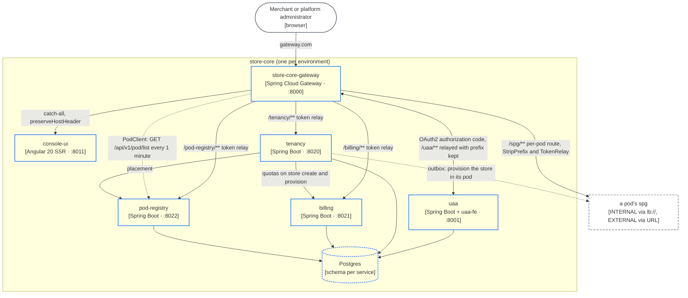

# store-core

The platform layer that runs once: gateway, uaa, console, tenancy, billing, pod-registry.

`store-core` is the control plane. It knows who the users are, which organizations own which stores, what each store is entitled to, and which pod hosts it. It holds none of a store's own data; that lives in the pod ([store-pod](/architecture/store-pod)). Six containers share one Postgres, each in its own schema, in the namespace `store-core.cvhome.lcl` behind `store-core-gateway`. Shapes follow the [legend](/architecture/system-context#legend).

## Diagram C2a

The request path for a signed-in merchant: browser → `store-core-gateway` → `console-ui` for the shell, then `/tenancy/**`, `/billing/**`, `/pod-registry/**`, `/uaa/**` on the same origin for data, and `/spg/**?store=<id>&pod=<podId>` for anything that lives in the store's pod. The gateway runs the OAuth2 authorization-code flow against `uaa`, keeps the session, and relays the access token on every backend route. `console-ui` never holds a token. Details: [Authentication](/architecture/authentication), [Gateway routing](/architecture/gateway-routing).

## store-core-gateway (:8000)

Reactive Spring Cloud Gateway (`spring-cloud-starter-gateway-server-webflux`). Main class `StoreCoreGatewayApplication`.

**Owns.** The browser session and the OAuth2 client login against `uaa` (`SecurityConfig`, `CapturingServerOAuth2AuthorizationRequestResolver`, `RedirectingServerAuthenticationSuccessHandler`, `AuthController`, `LogoutController`); the static route table (`GatewayRouteLocatorImpl`); the per-pod route table (`PodClient`).

**Routes** (`GatewayRouteLocatorImpl`):

| Path | Target | Filters |
|---|---|---|
| `/tenancy/**` | `lb://tenancy` | `stripPrefix(1)`, `tokenRelay()`, `preserveHostHeader()` |
| `/billing/**` | `lb://billing` | same |
| `/pod-registry/**` | `lb://pod-registry` | same |
| `/uaa/**` | `lb://uaa` | `tokenRelay()`, `preserveHostHeader()`, `X-Forwarded-Prefix: /uaa`; the prefix is kept because uaa builds absolute URLs from it |
| `/spg/**` with `store=` and `pod=<id>` | that pod's `spg` | `StripPrefix=1`, `TokenRelay`; one route per pod, built by `PodClient` |
| everything else on `gateway.com`, `www.gateway.com`, `console-ui.gateway.com` | `lb://console-ui` | `preserveHostHeader()` |

The `backendServices` array (`tenancy`, `billing`, `pod-registry`, `uaa`, `spg`) is negated to build the console's catch-all; a backend missing from it is answered with the console's HTML.

**PodClient.** Implements `RouteDefinitionRepository`. On a schedule (`cvhome.gateway.route-refresh-rate`, default `PT1M`) it calls pod-registry's `ReactiveExternalPodService.listPods()` and rebuilds one route per pod, id `pod-<short id>`, URI from `ServiceUrlBuilder` (`lb://spg.<namespace>` for an `INTERNAL` endpoint, the URL itself for `EXTERNAL`). The table is seeded from configuration at start, a failed refresh keeps the last-known-good set, and a `RefreshRoutesEvent` is published only when the set changed. `PodRoutesHealthIndicator` reports how long ago the last refresh succeeded.

**Database.** None.

## uaa (:8001)

Spring Boot service embedding the Angular 20 admin app `uaa-fe` (`src/main/resources/uaa-fe`, built on `@cvhome-saas/ui-kit`, copied into `static/` before `processResources`). Main class `UaaApplication`. Built on `store-commons/sso/sso-core`, the same authorization-server core as the pod's `cua`.

**Owns.** Staff and merchant identity for the whole platform: the OAuth2 authorization server and OIDC provider every other service trusts; users, roles, clients, settings, signing keys (rotated on a schedule, private halves encrypted with `secret-crypto`), sessions, audit, invitations; brokered login through external OIDC and OAuth 2.0 providers (`idp/`, `security/Brokered*`). There is no self-registration: accounts are provisioned or invited and their owner sets a password through a one-time link.

**External API.** `/api/v1/admin/**` (users, roles, clients, settings, keys, identity providers, audit, sessions, dashboard), gated on `SCOPE_super_admin` or `ROLE_SUPER_ADMIN` in `AppSecurityConfig` and again by `@PreAuthorize` per method. Reached from the console through the gateway's `/uaa/**` route, and directly on `uaa.gateway.com`, where the admin app is served. Services manage users through the `uaa-client` SDK. A `client_credentials` client per service (scope `store_core` or `store_pod`) is how services authenticate to each other.

**Database.** Its own schema in the store-core Postgres: JDBC sessions and a JDBC authorization store, so refresh tokens survive a restart and can be revoked.

## console-ui (:8011)

Angular 20, standalone components, server-side rendering (`app.config.server.ts`, `app.routes.server.ts`), Tailwind v4 over a three-theme token layer, Transloco (en, ar, RTL), `@cvhome-saas/ui-kit`. Signs in by redirecting to `/oauth2/authorization/uaa` on the gateway.

**Owns.** The merchant console and the platform-admin console, one app. Thirty-one feature areas under `src/app/features/`:

| Group | Feature areas |
|---|---|
| Merchant | `dashboard`, `orders`, `order-details`, `catalogue`, `products`, `product-form`, `content`, `storefront-builder`, `marketing`, `customers`, `shoppers`, `payments`, `store-management`, `create-store`, `users`, `identity-providers`, `billing`, `subscription`, `profile`, `legal` |
| Platform admin | `organizations`, `organization-detail`, `pods`, `pod-detail`, `platform-plans`, `platform-billing`, `platform-users`, `platform-dashboard` |
| Shell | `auth`, `first-run`, `not-found` |

Layers are tiered `features → layouts → shared → api → core → models`; the module's `ARCHITECTURE.md` is the contract.

**Database.** None.

## tenancy (:8020)

Spring Boot, `tenancy-service`, with the libraries `tenancy-commons` (DTOs, `ProvisioningState`) and `tenancy-events` (`OrgCreatedEvent`, `StoreCreatedEvent`, `StoreProvisionedEvent`, published through the namastack transactional outbox).

**Owns.** Organizations (`ManagerOrgId`), stores (`StoreMerchantId`), members and sign-up, and the store → pod routing table. `ManagerStoreEntity.podId` (`tenancy.manager_store.pod_id`) records which physical pod hosts each store; every downstream decision, from which gateway route matches to which region holds the data, derives from that column.

**Provisioning.** Creating a store writes the row with `NOT_STARTED_PROVISIONING` and `StoreCreatedEvent` into the outbox in the same transaction. The outbox delivers it to `StoreProvisioningService`, which marks `IN_PROGRESS`, asks pod-registry for placement (`PodPlacementApi`), builds a `MerchantStorePodClient` aimed at that pod (`StorePodClientFactory`) and creates the store in the pod's own `merchant` service, then marks `SUCCESSFULLY_PROVISIONING` or `FAILED_PROVISIONING` (the outbox retries). See [Tenancy and provisioning](/architecture/tenancy-provisioning).

**External API.** `StoreManagerController`, `OrgManagerController`, `SignUpController`, `UserAccountController`, `SaasController`, `RouterController` (resolves a store to its pod for internal callers), `StoreStatisticApi`, `OrgStatisticApi`; reached as `/tenancy/**`.

**Database.** Schemas `tenancy` (`manager_org`, `manager_store`) and `tenancy_outbox`; Spring Data JDBC, DDL in `schema.sql`.

## billing (:8021)

Spring Boot, `billing-service`, with `billing-commons` (ids, enums, DTOs, error catalog), `billing-events` (subscription events and commands) and `billing-external-api` (entitlement and quota clients).

**Owns.** Plans (`PlanCatalogService`), per-store subscriptions (`SubscriptionService`, `SubscriptionAuditService`), Stripe integration (`WebhookIngestService`, `WebhookApplyService`), entitlements (`EntitlementService`) and store quotas (`StoreQuotaService`).

**External API.**

| Path | Purpose | Caller |
|---|---|---|
| `PlanCatalogApi`, `SubscriptionApi` | Plans and a store's subscription | console via `/billing/**` |
| `POST /api/v1/stripe-webhook/public/events` | Stripe's events | Stripe |
| `GET /api/v1/entitlement/private/snapshot`, `POST .../snapshot/batch`, `GET .../blocked-stores` | What a store is entitled to | `catalog` (product writes through `StoreEntitlements`), the gateway, `tenancy` |
| `POST /api/v1/quota/private/store-create`, `POST .../provision` | Store quotas at creation and provisioning | `tenancy` |

The entitlement snapshot is the one call a pod makes back into `store-core`.

**Database.** Its own schema in the store-core Postgres.

## pod-registry (:8022)

Spring Boot, `pod-registry-service`, with `pod-registry-commons` (`PodView`, placement DTOs, lifecycle and health enums) and `pod-registry-external-api` (`ExternalPodService`, `ReactiveExternalPodService`, the placement client). Split out of tenancy in 2026-08; tenancy keeps the store → pod binding, pod-registry owns the pod.

**Owns.** The pod catalog: identity, endpoint, private-organization assignment, lifecycle, health, capacity and placement decisions. A pod's `PodEndpoint` is `INTERNAL` (same cluster, reached as `lb://spg.<namespace>` through service discovery) or `EXTERNAL` (a URL anywhere: another region, account or cloud). A pod with an `orgId` is dedicated to that organization; without one it is in the shared pool.

**External API.** `PodApi` at `/api/v1/pod`: `GET list` (the gateway's `PodClient`, with `SCOPE_STORE_CORE`), `GET`, `GET {id}`, `POST`, `PUT {id}`, `POST {id}/drain`; creating, updating and draining a pod is `ROLE_SUPER_ADMIN` only, listing is scoped to the caller's organization unless super admin. `PodPlacementApi` answers tenancy's placement request.

**Database.** Schema `pod_registry` (`pod_registry.pod`).

---

*Source of truth: cvhome `.claude/skills/project-structure/references/store-core.md`, `references/multi-tenancy.md`, `references/authentication.md`, `references/database-schemas.md`, `store-commons/autoconfigure/src/main/resources/common-config.yml`, `store-core/gateway/gateway-service/src/main/java/com/asrevo/cvhome/gateway/config/GatewayRouteLocatorImpl.java`, `store-core/gateway/gateway-service/src/main/java/com/asrevo/cvhome/gateway/client/PodClient.java`, `store-core/console-ui/src/app/features/`, `store-core/billing/billing-service/src/main/java/com/asrevo/cvhome/billing/api/v1/`, `store-core/pod-registry/pod-registry-service/src/main/java/com/asrevo/cvhome/podregistry/api/v1/PodApi.java`.*
