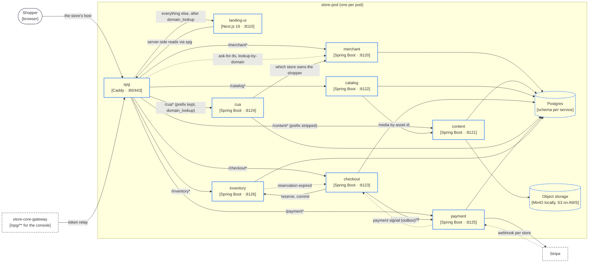

# store-pod

The business layer that runs once per pod: the Caddy edge, the storefront and seven services.

A pod is one complete, isolated deployment of everything on this page, with its own Postgres and its own namespace (`store-pod-<id>.cvhome.lcl`, domain `spg-<id>.gateway.com`). It hosts many stores. Which stores live in which pod is decided in `store-core` ([Tenancy and provisioning](/architecture/tenancy-provisioning)); the pod itself knows only the stores it was told to create. Shapes follow the [legend](/architecture/system-context#legend).

## Diagram C2b

Not drawn: every pod service accepts JWTs from both `uaa` (staff, via the gateway's token relay) and `cua` (shoppers), and authenticates to its peers with a `client_credentials` client against `uaa`; `catalog` asks `billing` in `store-core` for a store's entitlements before a product write. See [Containers](/architecture/containers) and [Authentication](/architecture/authentication).

<!-- img: /images/lcl/storefront-home.png — a demo store's home page on its own host, rendered by landing-ui through spg -->

## spg: the pod edge (:80, :443)

Caddy, configured by `store-pod/spg/Caddyfile`. Two sites, `http://` and `https://`, import the same `routes` snippet; the TLS site uses `on_demand` certificates stored in S3 (`storage s3`), and `on_demand_tls { ask $ASK_TLS_URL }` points at this pod's own `merchant` service, so a pod only mints certificates for its own tenants.

**Route table**, in Caddyfile order:

| Path | Target | Handler |
|---|---|---|
| `/content*` | `content:8121` | `handle_path`, prefix stripped |
| `/merchant*` | `merchant:8120` | `handle_path` |
| `/inventory*` | `inventory:8126` | `handle_path` |
| `/catalog*` | `catalog:8122` | `handle_path` |
| `/checkout*` | `checkout:8123` | `handle_path` |
| `/cua*` | `cua:8124` | `handle`, prefix kept, `X-Forwarded-Prefix: /cua`, preceded by `domain_lookup` |
| `/payment*` | `payment:8125` | `handle_path` |
| everything else | `landing-ui:8110` | `route` with `domain_lookup` |

Every route opens an OpenTelemetry span named after its target and returns `X-Trace-Id` and `X-Span-Id`. Responses are compressed here (`encode zstd gzip`); Spring Boot's and Next's own compression are off. `X-Forwarded-Port` is set to the site's public port because Tomcat drops the port from `X-Forwarded-Host`.

`domain_lookup` (the `caddy-domainlookup` plugin) calls `merchant`'s `GET /api/v1/router/public/lookup-by-domain` for the request's host, caches the answer for `DOMAIN_LOOKUP_TTL` (default `5m`), and injects `Store-Id`, `Theme`, `Color-Theme`, `Default-Language` and `Supported-Languages` as request headers. This is the tenant-resolution seam: one `landing-ui` serves every store in the pod and learns which one from these headers alone. `cua` gets the same lookup so it learns the store from the host rather than from the login form. The `/cua` prefix is kept because OAuth2 redirect URIs must match the issuer. See [Edge and custom domains](/architecture/edge-spg).

## The pod services

Each is a Spring Boot service in the `-commons` / `-core` / `-external-api` / `-service` module shape (except `cua`, one module), owning one Postgres schema named after the application and shipping its DDL in `init-sql/schema.sql`. Every endpoint takes a `StoreMerchantId` and a `LanguageCode`, and is guarded with `@PreAuthorize("hasPermission(...)")`. Services call each other through `@HttpExchange` interfaces from the `-external-api` modules; the provider's `External*Api` controller implements the same interface.

### merchant (:8120)

Store configuration: languages, currency, domains, address and contact, and for now the theme and color scheme. APIs: `MerchantStoreApi`, `ExternalMerchantStoreApi` (how `tenancy` creates the store during provisioning and how `cua` resolves a shopper's store). `RouterController` at `/api/v1/router` is the edge's hook: `GET public/ask-for-tls` (a certificate only for the pod's own domain or a domain a store in this pod owns), `GET public/lookup-by-domain` (the headers spg injects), `GET private/allocates`, `POST private/allocate`, `DELETE private/remove` (domain allocation per store). The `/merchant*` handler still forwards the legacy `/api/v1/content*` and `/api/v1/private/files` paths to `content`.

### content (:8121)

The content platform: pages, posts, banners, FAQ, policies, home sections, navigation menus, the media library and store appearance. One `content` and `content_description` table pair holds every `ContentType`; `site_settings` is one row per store with the logo, favicon, share image, social links and per-locale SEO. APIs under `/api/v1/private/content/{pages|posts|banners|faq|policies|sections}` (one `WorkflowContentApi` per type: publish, unpublish, review, archive, revisions, translations), `SiteSettingsApi`, media and menus; the public storefront API under `/api/v1/storefront/**`; `ExternalMediaApi` for `catalog` to resolve asset ids. `ScheduledPublishJob` promotes `SCHEDULED` rows once a minute. Files go to object storage (`S3Config`).

### catalog (:8122)

Products, categories (materialized-path tree), brands, product types, product groups and relationships, images, a store-wide option vocabulary and per-product variants. Every product owns at least one `product_variant`; sku lives at the variant level, and responses carry no price or quantity. APIs under `api/v1` and `api/v2`: `ProductApi`, `ProductApiV2` (definition, storefront listing and PDP, `/api/v2/products/search` and `/suggest`), `CategoryApi`, `ManufacturerApi`, `ProductTypeApi`, `ProductGroupApi`, `ProductRelationshipApi`, `ProductImageApi`, `ProductOptionApi`, `ProductVariantApi`, `ExternalProductApi` (by sku, s2s). Product writes are checked against `billing`'s entitlement snapshot (`StoreEntitlements`).

### checkout (:8123)

Cart, orders and customers. One `Order` aggregate owns every status transition under `@Version` and appends to the append-only `sales_order_event` ledger. Placement is durable: order row, then `RESERVE` (inventory), `INITIATE_PAYMENT` (payment), `COMMIT`, each remote step outside a transaction; `OrderRecoveryJob` re-drives a pending action and `OrderExpiryJob` closes unpaid orders. Customers (`customer_account`, unique per store and `cua` subject) and the JDK ISO country list live here. APIs: `CartApi` (public), `CheckoutApi` (`POST /cart/{code}/checkout`, `GET /order/{id}/status`), `OrderApi`, `CustomerAdminApi`, `StatisticApi`, `CustomerApi` (shopper), `ExternalOrderSignalApi` (`POST /private/orders/{ref}/signals/payment|reservation-expired`, idempotent, called by `payment` and `inventory`), `CountryApi`.

### payment (:8125)

Payment provider configuration per store (provider keys encrypted at rest with `secret-crypto`), payment execution and provider webhooks. Stripe is the integrated provider. APIs: `PaymentConfigurationController`, `PrivatePaymentApi`, `PublicPaymentConfigurationController`, `PublicPaymentWebhookApi` (`POST /api/v1/public/webhook/{storeId}/{paymentType}`, one webhook target per store), `ExternalPaymentGatewayApi` (what `checkout` calls to initiate). The `Transaction` aggregate registers `PaymentPaid`, `PaymentFailed`, `PaymentCanceled` and `PaymentRejected` events, and the transactional outbox pushes the resulting signal to `checkout`.

### inventory (:8126)

Stock, prices and reservations, keyed by sku and split out of catalog; `product_id` is informational, with no foreign key to catalog. APIs: `InventoryApi` (`PUT /private/inventory/{sku}`, `PUT /private/inventory/bulk`, deletes by sku and by product, `GET /private/inventory/by-products`), `ExternalInventoryApi` (public `GET /availability?skus=` and `POST /availability/query`), `ExternalProductReservationApi` (reserve, commit, release; `STORE-POD.INVENTORY.RESERVE`). Consumers merge price and stock into catalog data themselves: `console-ui` and `landing-ui` client-side, `checkout` server-side.

### cua (:8124)

Customer User Account: the shopper's OAuth2 authorization server, one per pod, a separate realm from `uaa` with its own user table and issuer. Built on the same `store-commons/sso/sso-core` as `uaa`. Self-registration (`POST /api/v1/public/registration`, JSON), social login per store (`MerchantIdentityProviderController`, `PublicSocialLoginController`), form-login processing.

`cua` is headless: it renders no HTML. `HandoffLoginEntryPoint` redirects an unauthenticated `/oauth2/authorize` to the storefront's `{origin}/{lang}/login?auth=1`; `landing-ui` renders the themed login form, which posts back to `/cua/login`; `StorefrontLoginSuccessHandler` resumes the authorize request. The storefront is a PKCE public client whose `client_id` is the store id (`StorefrontClientRepository`). It depends on `merchant-external-api` to resolve which store a shopper belongs to, and reads `Store-Id` from spg's `domain_lookup` rather than from the form.

## landing-ui: the storefront (:8110)

Next.js 16 / React 19, TypeScript, Tailwind v4, `next-intl`, in an npm-workspaces monorepo wrapped by Gradle (`ui-conventions`). `storefront/` is the one Next.js app; `libs/` holds `types`, `services`, `hooks`, `ui`, `i18n` and `theme`; `themes/<id>/` are the theme packages. The build is `build:libs` (types, services, hooks) then `next build` with standalone output; the old one-app-per-theme generation in `templates-deprecated/` is not built.

**Themes.** Twelve are registered in `registry.ts`: `basic`, `beauty`, `cosmetics`, `fashion`, `furniture`, `glasses`, `grocery`, `hunger`, `jewellery`, `pink`, `sports`, `starter`. The theme is resolved per request from spg's `Theme` header (`resolveThemeId()`; a dev-only `?theme=` override, then the header, then `STOREFRONT_THEME`, then the legacy map, else `starter`). `proxy.ts` rewrites `/{locale}/…` to `/t/<theme>/{locale}/…`, never redirects, so the browser keeps its URL; `/t/…` requested from outside is a 404, and a request with no `Store-Id` goes to `/store-not-found`. One route tree per theme means a page loads only its own theme's CSS and JS. Merchant colors come from the `Color-Theme` preset through a contrast-guarded bridge (`libs/theme/src/merchant-bridge.ts`).

**Reads.** Server renders call merchant, content, catalog, checkout and inventory through the pod's spg (`INTERNAL_SPG`) with a per-request abort signal and a `STOREFRONT_BACKEND_TIMEOUT_MS` budget (3000 ms). Browser-side calls (cart, listing, auth) go to `/catalog`, `/checkout`, `/cua`, … on the store's own origin, which spg routes.

**Static assets.** With `STATIC_ASSETS_SYNC_ENABLED=true`, the container pushes `.next/static` and `public` to `STATIC_ASSETS_S3_BUCKET` under `STATIC_ASSETS_S3_PREFIX` at start (`scripts/static-assets/sync-s3.mjs`, skipped when that build is already in the bucket), and `start.mjs` substitutes the build's `assetPrefix` sentinel with `STATIC_ASSETS_BASE_URL`, the CDN in front of the bucket (CloudFront on AWS); `STATIC_ASSETS_S3_ENDPOINT` with path style targets MinIO for local QA. Unset, the container serves its own assets.

### The page cache

Runs only under the production `start.mjs` (`storefront/scripts/server/cache/`); `next dev` has none of it. An anonymous document is kept in an in-process LRU store (`memory`, 64 MB, 1024 KB per entry by default) and served by **route class**, matched on the path after `/{locale}`:

| Class | Paths | TTL | Stale-while-revalidate | Edge `Cache-Control` |
|---|---|---|---|---|
| `home` | `/` | 30 s | 300 s | `public, s-maxage=30, stale-while-revalidate=300` |
| `category` | `/category/*` | 30 s | 300 s | same pattern |
| `product` | `/product/*` | 20 s | 120 s | |
| `search` | `/search` | 15 s | 60 s | |
| `content` | `/content/*`, `/blog`, `/blog/*` | 60 s | 600 s | |
| `help` | `/help`, `/policies/*` | 300 s | 3600 s | |
| `seo` | `/sitemap.xml`, `/robots.txt` | 600 s | 3600 s | |
| `shopper` | `/login`, `/register`, `/customer/*`, `/checkout/*`, `/callback` | never | | `private, no-store` |
| `api-theme-manifest`, `next-internal` | `/api/theme-manifest`; `/_next/*`, `/api/*`, `/t/*`, `/store-not-found` | never | | left as set |
| `default` | anything else | never | | `private, no-store` |

**Key.** `v1|<class>|host=…|store=…|theme=…|color=…|locale=…|path=…|q=…`, only the parts the class names: the host the shopper typed (`x-forwarded-host`), spg's `Store-Id`, `Theme` and `Color-Theme`, the locale, the path, and the query sorted with tracking parameters (`utm_*`, `fbclid`, `gclid`, `msclkid`, `_ga`, `ref`) dropped. Two stores on one task never share a key; a store whose theme changes gets a new one.

**Behavior.** A stale page is served at once and refreshed by a loopback request of the cache's own (`x-storefront-revalidate`); shoppers who miss while a page renders share that render. Never kept: a non-200, an HTML body that did not reach `</html>`, a render whose backend read aborted or timed out, a response setting any cookie but `NEXT_LOCALE`, a body over the entry limit. Bypassed whatever the class: a method other than GET or HEAD, an `Authorization` header, a client navigation or prefetch (Next's RSC headers), the theme or color override cookies, `?theme=`, `?color=`, `?preview=`. The class's `Cache-Control` is set before the render and enforced as the head is written, with a `Vary` naming the store headers, so an edge between spg and the shopper would key a document the same way.

**Observability.** Every response carries `x-storefront-cache: hit | miss | stale | stale-refresh | shared | bypass` (read by the k6 suite, so the values are fixed); `x-storefront-cache-class`, `-key` and `-reason` under `STOREFRONT_CACHE_DEBUG`. `GET /_storefront/cache/stats` (loopback, or `x-storefront-cache-token` matching `STOREFRONT_CACHE_STATS_TOKEN`) is a JSON snapshot of the policy, the store and the counters. The `storefront.cache` meter exports `storefront_page_cache_requests{state,class}`, `storefront_page_cache_entries{class}`, `storefront_page_cache_bytes{class}` and `storefront_page_cache_evictions{class,reason}`.

**Configuration.** Environment only: `STOREFRONT_CACHE_ENABLED`, `_STORE`, `_MAX_MB`, `_MAX_ENTRY_KB`, `_DEBUG`, `_STATS_TOKEN`, `_EVICTION_LOG_THRESHOLD`; per class `STOREFRONT_CACHE_<CLASS>_TTL_SECONDS`, `_SWR_SECONDS`, `_ENABLED`; and `STOREFRONT_CACHE_POLICY_JSON`, a partial table deep-merged over the defaults. An invalid value stops the start; the effective policy is logged once.

**The data cache.** Behind a page miss, `libs/services/src/cache-policy.ts` names each anonymous read (`store`, `categories`, `site`, `page`, `posts`, `post`, `banners`, `layout`, `faq`, `menu`, `policy`, `sitemap`, `redirect`, `product`, `productGroup`, `listing`, `facets`, `suggest`) and gives it seconds, overridable through `STOREFRONT_DATA_CACHE_<NAME>_SECONDS` (`productGroup` becomes `PRODUCT_GROUP`; `0` turns one off). Price and stock come from `inventory` and are never cached, nor is a preview or anything carrying a shopper's credential.

---

*Source of truth: cvhome `.claude/skills/project-structure/references/store-pod.md`, `references/landing-ui.md`, `references/authentication.md`, `references/multi-tenancy.md`, `store-pod/spg/Caddyfile`, `store-commons/autoconfigure/src/main/resources/common-config.yml`, `store-pod/merchant/merchant-service/src/main/java/com/asrevo/cvhome/merchant/api/v1/RouterController.java`, `store-pod/payment/payment-service` (`PublicPaymentWebhookApi`), `store-pod/landing-ui/storefront/src/shell/theme/registry.ts`, `store-pod/landing-ui/storefront/scripts/server/cache/{config,policy,key,edge-headers,metrics}.mjs`, `store-pod/landing-ui/storefront/scripts/static-assets/sync-s3.mjs`, `store-pod/landing-ui/libs/services/src/cache-policy.ts`, `.agents/plans/storefront-cache.md`.*
