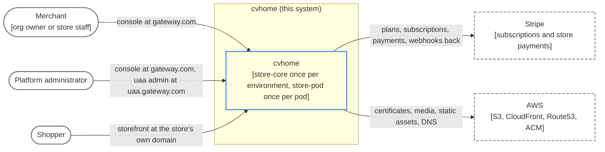
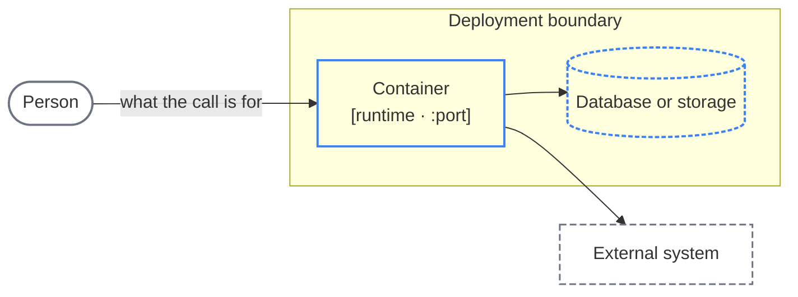

# System context

Who uses cvhome, what it talks to, and the legend the other architecture pages share (C4 level 1).

cvhome is a multi-tenant e-commerce SaaS. One platform layer (`store-core`) runs once per environment and holds identity, organizations, stores, plans and the routing table. A business layer (`store-pod`) runs once per pod and holds the stores' own data: catalog, content, carts, orders, customers, payments. A pod is a physical deployment; a store is a logical tenant placed in one pod. The next level down is [Containers](/architecture/containers).

## Diagram C1

## Actors

| Actor | Who | Entry point | Authenticated by |
|---|---|---|---|
| Merchant | An organization owner or a member of store staff. Creates stores, manages products, content, orders, customers, payments and the subscription. | The console at `gateway.com` (`store-core-gateway` :8000, which serves `console-ui`) | `uaa` |
| Platform administrator | The operator of the SaaS. Manages organizations, pods, platform plans, platform billing and platform users. | The same console at `gateway.com` (its platform-admin feature areas), plus the `uaa` admin app at `uaa.gateway.com` (`uaa` :8001, which embeds `uaa-fe`) | `uaa` |
| Shopper | A customer of one store. Browses, searches, registers, signs in, orders and pays. | The storefront on the store's own host, served by that pod's `spg` (Caddy) in front of `landing-ui` | `cua` (one per pod) |

Two entry points, two identity realms. Merchants and administrators arrive through the platform gateway and are authenticated by `uaa`; the gateway holds their session and relays their token to every platform service and into the pod that hosts the store they are working on. Shoppers never touch `store-core`: their request lands on the pod's edge, which resolves the host to a store and injects `Store-Id` and the theme headers before `landing-ui` renders. Details: [Authentication](/architecture/authentication), [Gateway routing](/architecture/gateway-routing) and [Edge and custom domains](/architecture/edge-spg).

The hostnames are the local ones from `common-config.yml` (`com.asrevo.cvhome.app.domain: gateway.com`, subdomains `www`, `console-ui`, `uaa`; pod domain `spg-507f1f77.gateway.com`). A deployment substitutes its own.

## External systems

| System | Used by | For |
|---|---|---|
| Stripe | `billing` (store-core) | Platform plans and per-store subscriptions; `StripeWebhookApi` receives Stripe's events. |
| Stripe | `payment` (store-pod) | The integrated payment provider for a store's checkout; `PublicPaymentWebhookApi` receives events per store at `/api/v1/public/webhook/{storeId}/{paymentType}`. |
| AWS S3 | `spg` (Caddy `storage s3`), `content`, `merchant`, `payment`, `landing-ui` | TLS certificates for custom domains; the media library and files; the storefront's static assets pushed at container start. MinIO stands in locally. |
| AWS CloudFront, Route53, ACM | The AWS deployment (`cvhome-platform`) | Serving static assets and media from the edge, DNS, and the platform's own certificates. See [Deployment: AWS](/architecture/deployment-aws). |

## Legend

Every diagram on the architecture pages uses the same shapes and strokes.

| Shape | Meaning |
|---|---|
| Stadium, gray | A person: merchant, shopper, platform administrator. |
| Rectangle, solid blue | A container: one deployable unit (a Spring Boot service, an Angular SSR or Next.js server, the Caddy edge). The second line names its runtime and the port from `common-config.yml`. |
| Cylinder, dashed blue | A database or object store. |
| Rectangle, dashed gray | An external system cvhome does not run. |
| Subgraph | A deployment boundary: `store-core (one per environment)` or `store-pod (one per pod)`. |
| Solid arrow | A synchronous HTTP call in the direction of the request. The label says what it is for; a path on the label is the route the caller uses. |
| Dotted arrow | A scheduled or asynchronous call (a poll, an outbox delivery, a webhook). |

Ports are the container's own port. From outside its boundary a container is only reachable as a path on its gateway: `store-core-gateway` for the platform layer, `spg` for a pod.

---

*Source of truth: cvhome `.claude/skills/project-structure/SKILL.md`, `store-commons/autoconfigure/src/main/resources/common-config.yml`, `store-pod/spg/Caddyfile`, `store-pod/payment/payment-service` (`PublicPaymentWebhookApi`), `store-core/billing/billing-service` (`StripeWebhookApi`), `store-pod/landing-ui/storefront/scripts/static-assets/sync-s3.mjs`; cvhome-platform `main.tf`.*
