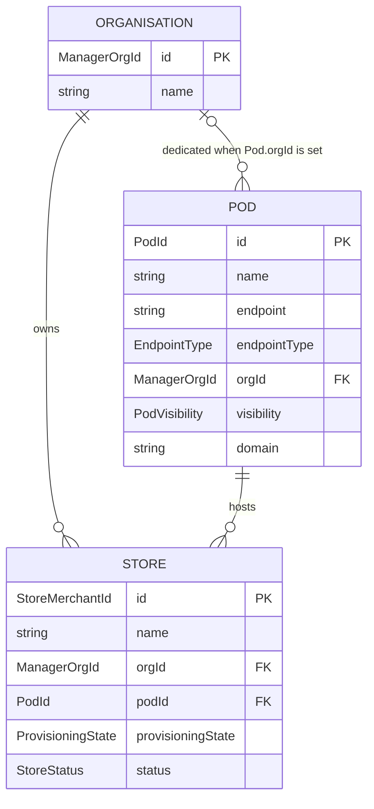
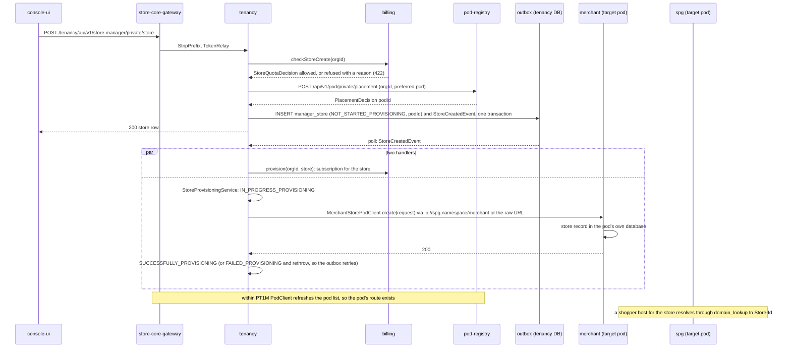

# Tenancy and provisioning

Organisation, store and pod; how a new store lands in a pod and how requests find it (C4 level 3).

The idea that everything else follows from: **a store is a logical tenant; a pod is a physical deployment.** tenancy owns organisations, stores and the store-to-pod binding. pod-registry owns the pods. The pod owns the store's actual data. Legend: [system context](/architecture/system-context#legend).

## The three entities



| Level | Identifier | Table | Meaning |
|---|---|---|---|
| Organisation | `ManagerOrgId` | `tenancy.manager_org` | the customer account that signs up and pays; owns stores |
| Store | `StoreMerchantId` | `tenancy.manager_store` plus the pod's own database | one storefront, the unit a shopper visits |
| Pod | `PodId` | `pod_registry.pod` | a physical deployment of the whole store-pod stack; hosts many stores |

`StoreMerchantId` is the one store identifier everywhere: tenancy, billing, pod-registry, the gateway and every pod. Its value is ObjectId hex, minted only by tenancy (`StoreMerchantId.newId()`). `ManagerStoreEntity.podId` is the whole routing table: which gateway route matches, which database holds the products and which region serves the shopper are all derived from that one column.

### What a pod physically is

One pod is one complete, isolated deployment of the tenant layer: spg, merchant, content, inventory, catalog, checkout, payment, cua and landing-ui, with **its own Postgres** and its own service-discovery namespace. On AWS `cvhome-platform/modules/store-pod` creates per pod an `aws_service_discovery_private_dns_namespace`, an ECS cluster, an `aws_db_instance`, an NLB in front of spg (`services.yaml`, `edge.lb: nlb`), a CloudFront distribution for the pod's CDN bucket and an S3 bucket for TLS certificates. Nothing in a pod is shared with another pod.

```java
public record Pod(PodId id, String name, PodEndpoint endpoint, ManagerOrgId orgId, String domain) { ... }
public record PodEndpoint(String endpoint, EndpointType type) { }   // INTERNAL | EXTERNAL
```

- **`PodId.shorten()`** returns the first 8 characters of the ObjectId. That short form is the pod's name in infrastructure: namespace `store-pod-507f1f77.cvhome.lcl`, edge host `spg-507f1f77.gateway.com`, gateway route id `pod-507f1f77`, s2s client `store-pod-507f1f77@service.store-pod.internal`.
- **Shared pool or dedicated.** `PodVisibility` is its own column: a `PUBLIC` pod is shared and carries no org; a `PRIVATE` pod belongs to one organisation, named in `org_id`, and only that organisation's stores may land on it. The column is separate from `org_id` so an operator can hold a pod out of public rotation without inventing an owner.
- **`EndpointType`.** `INTERNAL` means the pod is in the same VPC and is reached through service discovery: `ServiceUrlBuilder.getServiceUrl(Pod)` returns `lb://spg.<endpoint>`. `EXTERNAL` means the raw endpoint URL is used as is, which is how a pod in another region, account or cloud is reached with the same code path. Assigning a store to a pod in `eu-central-1` puts its data in the EU; nothing else changes.

### Who owns pods

Pods moved out of tenancy in 2026-08 (`.agents/plans/tenancy-and-pod-registry-split.md`, `extra/migrations/2026-08-12-move-pods-to-pod-registry.sql`). pod-registry (:8022) owns pod identity, endpoint, visibility, lifecycle (`drain`, `resume`), health, capacity and placement, all of `/api/v1/pod/**`. tenancy keeps the store-to-pod binding (`manager_store.pod_id`, `RouterApi`, `StorePodClientFactory`, `StoreProvisioningService`).

`PodApi` gates every method with `hasPermission(null,'PodId','STORE-CORE.POD.READ'|'STORE-CORE.POD.MANAGE')`. `MANAGE` (create, update, drain, resume, delete) is platform-operator only: a pod is infrastructure, not a self-service resource. `READ` is tenant-scoped: a super admin and a service principal see every pod, an org admin sees only its own private pods. `GET /api/v1/pod/list` is the unpaged form the gateway polls ([gateway routing](/architecture/gateway-routing)). Placement is `POST /api/v1/pod/private/placement` behind `STORE-CORE.POD.PLACEMENT`.

## Provisioning a store



Step by step, from `StoreManagerServiceImpl.createStore`:

1. **Billing gates creation.** `billingQuotaService.checkStoreCreate(new StoreQuotaRequest(orgId))` must answer `allowed`; otherwise `StoreQuotaRefusedException` is thrown, a 422 with billing's reason. Billing unreachable is `BillingApiUnavailableException`, not a silent yes.
2. **pod-registry places the store.** `placementService.place(new PlacementRequest(orgId, preferredPodId))` returns the `PlacementDecision` whose `podId` is written on the store row. An org can prefer a pod; pod-registry decides.
3. **The row and the event are one transaction.** `ManagerStoreEntity.createStore(...)` sets `NOT_STARTED_PROVISIONING` and registers `StoreCreatedEvent`, which the outbox library writes in the same transaction. A duplicate name is caught outside the transaction and answered as `DuplicateStoreNameException`.
4. **The outbox poller dispatches the event** to two `@OutboxHandler` methods: `BillingProvisioningEventImpl` provisions the store's subscription in billing, and `ManagerStoreCreatedEventImpl` calls `StoreProvisioningService.provisioning(...)`.
5. **`StoreProvisioningService`** marks `IN_PROGRESS_PROVISIONING`, asks `StorePodClientFactory` for a `MerchantStorePodClient` aimed at the chosen pod (built with the pod-aware `RestClientBuilder.buildClient(pod, "merchant", ...)`, cached per `PodId`), and calls `create(...)`. Success marks `SUCCESSFULLY_PROVISIONING`; an exception marks `FAILED_PROVISIONING` with the reason and rethrows so the outbox retries. Handlers are idempotent because delivery is at-least-once.
6. **The pod's merchant service** creates the real store record in its own database. From then on that store's products, orders and customers never leave the pod. Domains are allocated per store through merchant's `router/private/allocate`.

Provisioning is asynchronous on purpose: it crosses a network boundary into possibly another region and must survive the pod being briefly unavailable. Doing it inline would fail store creation whenever a pod hiccups.

## Two runtime paths to a store

**Seller path.** The console calls `gateway.com/spg/<service>/...?store=<id>&pod=<podId>`. store-core-gateway's `PodClient` refreshes the pod list from pod-registry every `PT1M` and keeps one route per pod, so a newly created pod is reachable within a minute without redeploying the gateway. The route strips `/spg`, relays the seller's uaa token, and points at `lb://spg.<namespace>` for an `INTERNAL` pod or the raw URL for an `EXTERNAL` one. `RouterApi.getStorePodByStoreId` (`GET /api/v1/router/store-pod-by-store-id`) resolves a store to its pod for internal callers.

**Shopper path.** A shopper never touches store-core. The host name resolves to the pod's spg, whose `domain_lookup` middleware asks the pod's own merchant service which store owns the domain and injects `Store-Id` and the theme headers before landing-ui renders ([edge and custom domains](/architecture/edge-spg)). Both hooks (`lookup-by-domain`, `ask-for-tls`) are pod-local, so one pod can neither route nor mint certificates for another pod's tenants.

## Isolation summary

| Concern | Isolation |
|---|---|
| Store data (products, orders, customers) | per pod database; never crosses pods |
| Shopper identity | per pod; each pod runs its own cua, one realm per store |
| Seller and staff identity | shared; one uaa for the platform |
| Billing, subscriptions, org and store registry | shared; tenancy and billing |
| Pod catalog and placement | shared; pod-registry |
| TLS certificates | per pod; S3-backed Caddy storage, pod-local `ask` check |
| Physical region | per pod, via `PodEndpoint` |

If a feature is about a shopper or a store's own data, it belongs in a pod. If it is about accounts, plans, provisioning or which pod hosts what, it belongs in the control plane.

---

*Source of truth: cvhome `.claude/skills/project-structure/references/multi-tenancy.md`, `events-outbox.md`; cvhome `store-commons/commons/src/main/java/com/asrevo/cvhome/commons/domain/{Pod,PodEndpoint,EndpointType,PodId}.java`; cvhome `store-core/tenancy/tenancy-service/src/main/java/com/asrevo/cvhome/tenancy/manager/{entity/ManagerStoreEntity,entity/ManagerOrgEntity,service/impl/StoreManagerServiceImpl,service/StoreProvisioningService,processors/event/ManagerStoreCreatedEventImpl,processors/event/BillingProvisioningEventImpl,controller/RouterApi}.java`; cvhome `store-core/pod-registry/pod-registry-service/src/main/java/com/asrevo/cvhome/podregistry/api/v1/{PodApi,PodPlacementApi}.java`, `pod-registry-commons/.../PodVisibility.java`; cvhome `extra/migrations/2026-08-12-move-pods-to-pod-registry.sql`; cvhome `.agents/plans/tenancy-and-pod-registry-split.md`; cvhome-platform `services.yaml`, `modules/store-pod/{main,rds,storage}.tf`.*
