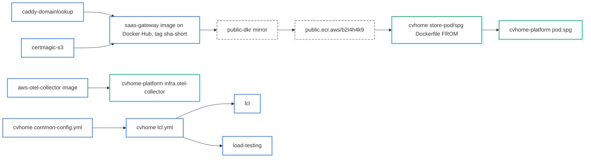

# Repositories

Every repository in the cvhome-saas organization, what it is for, and how the images chain from the Caddy plugins to the pod edge on AWS. The manifest is `repos.yaml` in the orchestrator repository. "Release tag" marks the repositories that receive the same `vX.Y.Z` tag when a release is cut; the others are versioned by their own publishing or not at all.

| Repository | Kind | Release tag | Purpose |
|---|---|---|---|
| [orchestrator](https://github.com/cvhome-saas/orchestrator) | docs | | The organization root: the repository manifest, clone and status scripts, the task-routing skills, the cross-repo reviewer and the release workflow. |
| [cvhome](https://github.com/cvhome-saas/cvhome) | app | yes | The application monorepo: Java 25 / Spring Boot services, the Angular console, the Next.js storefront, one Gradle build. Source of truth for services and ports (`common-config.yml`); builds every service image, including `store-pod/spg` on top of the saas-gateway image. |
| [cvhome-platform](https://github.com/cvhome-saas/cvhome-platform) | infra | yes | AWS infrastructure: Terraform (ECS Fargate, Cloud Map, ALB and NLB, RDS, CloudFront), the one-click CloudFormation bootstrap and the CodeBuild pipeline that builds cvhome's images and applies. `services.yaml` mirrors the app catalog and is drift-checked in CI. |
| [lcl](https://github.com/cvhome-saas/lcl) | tool | yes | The public npm CLI `@cvhome-saas/lcl`: a language-neutral local stack runner driven by one `lcl.yml`. cvhome depends on it and owns only its `lcl.yml`. |
| [load-testing](https://github.com/cvhome-saas/load-testing) | tool | | k6 load, stress, soak, breakpoint and browser suite for cvhome, against an lcl stack or AWS; its thresholds align with the app's SLO histogram buckets. Also hosts the compose stack with the telemetry backends. |
| [e2e-testing](https://github.com/cvhome-saas/e2e-testing) | tool | | Playwright end-to-end suite for cvhome. A scaffold so far: default config, one example spec, a CI workflow. |
| [saas-gateway](https://github.com/cvhome-saas/saas-gateway) | image | yes | The Caddy base image (xcaddy with certmagic-s3 and caddy-domainlookup, Alpine runtime) that `store-pod/spg` builds `FROM`. Publishes `latest` and `sha-<short>` to Docker Hub on every push to `main`. |
| [caddy-domainlookup](https://github.com/cvhome-saas/caddy-domainlookup) | plugin | yes | Caddy v2 middleware `domain_lookup`: maps the request host to tenant headers (`Store-Id`, `Theme`, ...) through the merchant service's lookup API, cached, failing open. Compiled into saas-gateway. |
| [certmagic-s3](https://github.com/cvhome-saas/certmagic-s3) | plugin | yes | The organization's fork of the certmagic S3 storage backend. Gives Caddy `storage s3 { ... }` so every spg task shares on-demand certificates through the pod's certificate bucket. Compiled into saas-gateway. |
| [aws-otel-collector](https://github.com/cvhome-saas/aws-otel-collector) | image | yes | ADOT collector image with the project's configuration baked in (OTLP in; X-Ray, EMF and CloudWatch Logs out). One per AWS environment, referenced from cvhome-platform's `services.yaml` as `infra.otel-collector`. |
| [public-dkr](https://github.com/cvhome-saas/public-dkr) | mirror | | A GitHub Actions matrix that pulls images from Docker Hub and gcr.io and pushes them to the organization's public ECR, `public.ecr.aws/b2i4h4k9`. The mirror step between saas-gateway's Docker Hub build and the sha cvhome pins; also supplies the node, PostgreSQL, distroless and buildpack base images. |
| [cvhome-saas.github.io](https://github.com/cvhome-saas/cvhome-saas.github.io) | docs | | This site: VitePress on GitHub Pages. |
| [assets](https://github.com/cvhome-saas/assets) | docs | | Retired. Held `fast-run.sh`, the one-command evaluation install of the 1.0.x layout; `lcl` replaced it. |
| [.github](https://github.com/cvhome-saas/.github) | docs | | The organization profile shown on github.com/cvhome-saas and community health defaults. |
| [ideation](https://github.com/cvhome-saas/ideation) | ideas | | The product backlog as Markdown feature documents with a template and a status table. Where a new idea is filed before it becomes a plan. |

## How the repositories feed each other

Three chains connect them. The Caddy plugins are compiled into the saas-gateway image, which is mirrored to public ECR, pinned by cvhome's `store-pod/spg/Dockerfile` and deployed as the pod edge by cvhome-platform. The collector image is deployed once per environment. And cvhome's service registry drives its `lcl.yml`, which both the local runner and the load tests read.

Bumping the edge therefore takes three repositories in order: a change in a plugin or in saas-gateway publishes a new `sha-<short>` on Docker Hub; public-dkr mirrors that sha to public ECR; cvhome moves the `FROM` pin in `store-pod/spg/Dockerfile`, and the next image build in cvhome-platform's pipeline picks it up. Each step is a pull request in its own repository.

## The orchestrator

The orchestrator repository is where work on the organization starts and where anything no single repository can own lives.

- **Routing.** `repos.yaml` names every repository, its kind and its entry points, and the scripts clone or refresh checkouts. A task is classified first (application, infrastructure, tools, docs, or several), then handed to the owning repository's own rules. Work that spans repositories is split into one work item and one pull request per repository, producers before consumers.
- **Cross-repo review.** Before a pull request opens in any repository, the change is reviewed for what it does to the others: a port, service, environment variable, secret, route, image pin, SLO or host name that another repository copies. `scripts/contract-check.py` is the standing audit of those shared facts and runs nightly.
- **Releases.** Releases are cut here and nowhere else. The `Release` workflow tags every `tag: true` repository above with the same version and writes `releases/vX.Y.Z.yaml` as the compatibility record. It deploys nothing; deploying a version is cvhome-platform work. No repository carries a version file, and no `v*` tag is pushed by hand.

The rules every repository follows the same way (a fresh worktree per change, a plan as one pull request with one commit per phase, a verify receipt before any push, a QA file per area) are on [Contributing](/development/contributing).

---

*Source of truth: orchestrator `repos.yaml`, `CLAUDE.md`; cvhome `store-pod/spg/Dockerfile`, `docker-compose-lcl.yml`; cvhome-platform `services.yaml`.*
