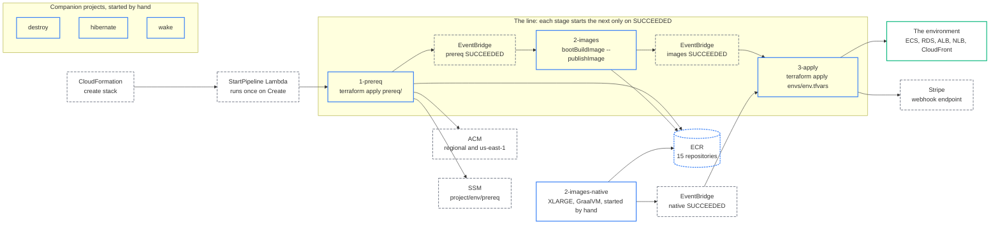

# Pipeline and promotion

The three CodeBuild stages, how they chain, and how a version reaches an environment.

CodeBuild is the deployer. GitHub Actions in cvhome-platform only validates (format, validate, lint, catalog
drift, cfn-lint, a `plan (dev)` comment on same-repo PRs, `release-guard` on tags) and never applies; nothing is
deployed from cvhome's CI either. Legend: [system context](/architecture/system-context#legend).

## The chain



The bootstrap stack's `StartPipeline` custom resource starts `1-prereq` once, on stack creation, and nothing
else: a failed kickoff does not roll the stack back, and the pipeline can be started from the CodeBuild console
by hand. Two EventBridge rules on `CodeBuild Build State Change` with `build-status: SUCCEEDED` chain the
stages, so a failure stops the line instead of racing ahead to an apply that cannot work. All projects check
out the `Branch` the stack was given, and all Terraform projects install Terraform 1.14.6.

| Project | Source | Role | Compute | Does |
|---|---|---|---|---|
| `<project>-<env>-1-prereq` | cvhome-platform | DeployRole | SMALL | `terraform init` on `prereq/<env>/terraform.tfstate`, `terraform apply` of `prereq/`: one ECR repository per catalog image, the regional certificate for `<env-domain>` and `*.<env-domain>`, the same names in us-east-1 for CloudFront, DNS validation records, and the `/<project>/<env>/prereq` SSM record (certificate ARNs and `app_domain`). Prints `repository_count`. |
| `<project>-<env>-2-images` | cvhome | BuildRole | LARGE, privileged, local Docker layer, custom and source caches | Corretto 25; `docker login` to ECR; `./gradlew bootBuildImage --publishImage $VERSION_FLAG -x test -x check --no-daemon --parallel --build-cache`. Checks the application out at `v<ImageTag>` when `ImageTag` is a version, else at `Branch`. |
| `<project>-<env>-2-images-native` | cvhome | BuildRole | XLARGE, privileged | The same build with `-Pnative -PnativeImageArgs=-J-Xmx12g --max-workers=4`: the twelve Spring services as GraalVM native executables. Never started by the line; start it by hand (CodeBuild console or `aws codebuild start-build --project-name <project>-<env>-2-images-native`) and it chains to `3-apply`. Both builds publish the same tags, so the last one to run is what the environment runs. Do not start it while the line is running. |
| `<project>-<env>-3-apply` | cvhome-platform | DeployRole | SMALL | `terraform init` on `env/<env>/terraform.tfstate`; `terraform apply` with `-var-file=envs/<env>.tfvars` (falls back to `envs/dev.tfvars` when the environment has no file), `project`, `env`, `flavour` and `region` from the stack; then `scripts/register-stripe-webhook.sh https://<env-domain>/billing/api/v1/stripe-webhook/public/events` and `terraform output console_url`. |
| `<project>-<env>-destroy`, `-hibernate`, `-wake` | cvhome-platform | DeployRole | SMALL | See [hibernate, wake, destroy](/operations/lifecycle). |

The Stripe webhook is registered after the apply, not in CloudFormation, because the endpoint URL contains
the domain and the domain only exists once the load balancer does. The script stores the signing secret in the
`stripe` secret, where billing reads it, and skips when no Stripe key was configured.

### Caching in `2-images`

Measured on one build: 826 s total, of which `bootBuildImage` was 606 s, and inside that the buildpack
builder image was pulled 12 times, the run image 12 times and the syft binary downloaded 12 times, because the
lifecycle runs in a fresh container per service. The project therefore enables three local cache modes:
`LOCAL_DOCKER_LAYER_CACHE` keeps the builder and run images on the host; `LOCAL_CUSTOM_CACHE` keeps
`/root/.gradle/caches` and `/root/.gradle/wrapper` so `--build-cache` and the Gradle distribution survive
between builds; `LOCAL_SOURCE_CACHE` keeps the checkout. Local caching is opportunistic: it pays off when
CodeBuild reuses a warm host and costs nothing when it does not, so a cold build is simply today's timing.
`GRADLE_OPTS` sets `-Xmx10g`, no daemon, parallel and caching on.

## The versioning contract

cvhome's `gradle.properties` is `0.0.0-SNAPSHOT` forever. The real version is the git tag, passed into the
build as `-Pversion`:

| Build | Checkout | `-Pversion` | Tags published per image |
|---|---|---|---|
| Release, `ImageTag = X.Y.Z` | `vX.Y.Z` | `X.Y.Z` | `X.Y.Z`, `X.Y`, `latest` |
| Branch, `ImageTag = latest` | `Branch` | none, stays `0.0.0-SNAPSHOT` | `latest` only |

The rule lives in cvhome's build logic (`docker-conventions.gradle`, `java-application-conventions.gradle`): a
release version also gets its `X.Y` and `latest` tags; a `-SNAPSHOT` gets only `latest`, so a developer's
push can never claim a release number or overwrite a released tag. Images are pushed to
`<account>.dkr.ecr.<region>.amazonaws.com/<project>/<image>` where `<image>` is the catalog's `store-core/...`
or `store-pod/...` path. How the tag itself is cut is on [releases](/operations/releases).

## Promotion and rollback

What an environment runs is one line in cvhome-platform:

```hcl
# envs/<env>.tfvars
image_tag = "2.0.0"      # the product version this environment deploys
```

Configuration layers as `flavours.yaml` < SSM `/<project>/<env>/config` < `envs/<env>.tfvars`, so once that
line exists it wins over the `ImageTag` typed into the stack. There is no `latest` fallback: a missing
`image_tag` is an error.

| Action | What it is |
|---|---|
| Promote | A PR changing `image_tag` to the new version, then running `3-apply`. The orchestrator opens it for `dev` and auto-merges on green; for `staging` and `prod` a person merges. |
| Roll back | The same PR with the previous version, then `3-apply`. |
| Deploy | `3-apply` runs `terraform apply`; the task definitions reference `<registry>/<image>:<image_tag>` and ECS rolls the services. |

`latest` is tolerated in `dev` and `staging` until the first tagged release and refused for a protected
flavour twice: at plan time by a precondition in `main.tf`, and on every `v*` tag by the `release-guard` CI job
(`scripts/check-release-pins.py`). Once `prod.tfvars` pins a version, `latest` never reaches it again.

Terraform finishing is not the environment being ready: it returns once ECS accepts the deployments. Spring
services need a minute or two beyond that, and a task that fails its health check is rolled back by the ECS
deployment circuit breaker.

## The catalog drift check

`services.yaml` is the single source of truth for the 15 services, and `scripts/check-catalog-drift.py` fails CI
when it disagrees with the application repo. It compares three independent sources, without any YAML
dependency:

| Source in cvhome | Checked against |
|---|---|
| `store-commons/autoconfigure/src/main/resources/common-config.yml` (`com.asrevo.cvhome.services.<name>.port`) | names and ports |
| `store-commons/autoconfigure/src/main/resources/fargate-config.yml` (`ecs.discovery.service-ports`, `loadbalancer.eager-load.clients`) | names and ports |
| every service's `build.gradle` (`imageName = createImageName("<path>", ...)`, `imageGroup`) | image paths |

The `infra` section (the otel-collector) is excluded on purpose. The check picks the application branch by
name: cvhome-platform `main` against cvhome `main`; a branch against the cvhome branch of the same name when
one exists, else `main`; tag `vX.Y.Z` against cvhome `vX.Y.Z`. A branch counts only when the GitHub API echoes
back the exact name asked for, because GitHub keeps a redirect from a renamed branch's old name. cvhome is
public, so the job needs no secret; if the repository cannot be read at all the job fails rather than skips.
Run it locally with:

```bash
python3 scripts/check-catalog-drift.py --app-repo ../cvhome
```

---

*Source of truth: cvhome-platform `bootstrap/bootstrap.yaml` (buildspecs), `README.md`, `AGENTS.md`,
`scripts/check-catalog-drift.py`, `scripts/register-stripe-webhook.sh`, `envs/*.tfvars`, `main.tf`,
`.github/workflows/terraform-validate.yml`; cvhome `build-logic/src/main/groovy/com.asrevo.docker-conventions.gradle`.*
